# PNA GNN: Performance, Energy, and Efficiency Analysis

This report presents a profiling study of the **Principal Neighbourhood Aggregation (PNA)** graph neural network trained on a molecular property prediction task. We examine how batch size affects training latency, GPU utilisation, and energy consumption, and investigate the sources of step-time variability at different operating points.

---

## Table of Contents

1. [The PNA Workload](#1-the-pna-workload)
2. [Experiment Setup](#2-experiment-setup)
3. [Training at Batch Size 4096](#3-training-at-batch-size-4096)
4. [Training at Batch Size 512 — GC Spike Attribution](#4-training-at-batch-size-512--gc-spike-attribution)
5. [Batch-Size Comparison](#5-batch-size-comparison)
6. [Energy and Carbon](#6-energy-and-carbon)
7. [Measurement Overhead](#7-measurement-overhead)
8. [Summary](#8-summary)

---

## 1. The PNA Workload

### What Is PNA?

**Principal Neighbourhood Aggregation (PNA)** is a GNN architecture that applies *multiple* aggregation functions (mean, min, max, std) simultaneously at each layer and scales their outputs by node degree. This multi-aggregator design makes it more expressive than standard message-passing networks.

The model is trained on a molecular dataset where each graph represents a molecule (nodes = atoms, edges = bonds). The regression target is a quantum-chemical property. The model uses **64 PNA convolution layers**, **4 aggregators**, and **3 scalers**, totalling ~4 million parameters.

### Training Pipeline

Each training step follows three phases:

```
 FORWARD       64 layers of neighbourhood aggregation + global pooling + L1 loss
 BACKWARD      autograd through 64 conv layers over irregular sparse graphs
 OPTIMIZER     Adam weight update + cosine-annealing LR schedule
```

Data loading is handled by PyTorch Geometric's `DataLoader`, which collates variable-size molecular graphs into a single batched graph. This involves stacking node feature tensors, concatenating and offset-shifting edge index tensors, and building batch assignment vectors — all Python-heavy operations that create significant GC pressure.

---

## 2. Experiment Setup

### Dataset

All experiments use **PCQM4Mv2**, a large-scale quantum chemistry dataset from the Open Graph Benchmark. Each sample is a molecular graph: nodes represent atoms (with features encoding atomic number, chirality, formal charge, etc.) and edges represent chemical bonds. The regression target is the HOMO-LUMO gap, a quantum property governing a molecule's optical and electronic behaviour.

We use a **10 000-graph subset** of the training split. This is large enough to exhibit realistic batch-composition effects (partial batches, variable graph sizes) while keeping individual experiment runtimes manageable for sweeping across multiple configurations.

### Training Configurations

| Configuration | Batch Sizes | Workers | Purpose |
|:---|:---|:---:|:---|
| **Primary** | **4096** | 2 | Main focus — largest batch that fits in GPU memory. Reveals high-utilisation regime, batch-shape effects, and GC interactions at scale. |
| **Secondary** | **512** | 2 | Contrast point — smaller batches expose GC spike patterns and different forward/backward cost balance. |
| **Trend** | 1024, 2048 | 2 | Fill in the scaling curve between 512 and 4096 for utilisation, latency, and energy. |
| **Worker sweep** | 4096 | 0, 2, 4 | Isolates the effect of DataLoader parallelism on GPU utilisation and throughput at fixed batch size. |

All runs use **2 DataLoader workers** by default, which overlap CPU-side graph collation with GPU computation. The worker sweep at bs4096 additionally tests 0 and 4 workers to quantify the impact of this pipelining.

**Batch size 4096** is the largest configuration that fits in GPU memory on our hardware. Attempts at 8192 result in out-of-memory errors. This makes 4096 the natural operating point for maximum GPU occupancy and the focus of our analysis. **Batch size 512** serves as a contrast — its short steps and frequent GC triggers produce qualitatively different behaviour, particularly around garbage-collection spikes.

The intermediate sizes (1024, 2048) are included to show the **trend** when varying batch size: how GPU utilisation, epoch latency, and energy scale between the two extremes. They are not analysed in as much detail individually.

### Measurement Types

We build up instrumentation in layers, starting from a raw observation of the workload and progressively adding controlled measurements:

| # | Measurement | Purpose | What It Records |
|:-:|:---|:---|:---|
| 1 | **Raw measurement** | Capture the workload as-is, comparing behavior of different batch sizes. | CUDA-synced step timing. |
| 2 | **GC-controlled e2e baseline** | Establish a clean baseline free of GC noise. Automatic GC disabled during training; full gen-2 sweep forced between epochs. Foundation for measurements 3 and 4. | Same step & substep timing as raw, but without GC-induced variability. |
| 3 | **Hardware utilisation** | Quantify GPU, CPU, and memory usage across batch sizes. Built on (2). | GPU util (`pynvml`), per-process CPU util (`psutil`), RAM usage. Sampled at 500 ms intervals. |
| 4 | **Energy and carbon** | Measure per-step energy consumption and CO₂ emissions. Built on (2). | CPU/GPU/RAM energy breakdown (kWh) and CO₂ emissions via CodeCarbon `OfflineEmissionsTracker` with 500 ms measurement windows. |

Each layer motivates the next: the raw measurement reveals GC spikes → the spike experiment confirms GC as the cause → manual GC creates a clean baseline → utilisation and energy measurements build on that baseline without GC noise.

All measurement types add less than 0.3% overhead to step latency (see [Section 7](#7-measurement-overhead)), so the numbers they report are representative of the uninstrumented workload.

---

## 3. Training at Batch Size 4096

At batch size 4096, the training dataset yields **3 steps per epoch**: two full batches of 4096 graphs and one partial batch of 1808 graphs (the remainder). This creates a distinctive repeating pattern.

### The Step-Time Pattern Is Driven by Batch Shape

The total-time plot shows a striking alternation between ~775 ms steps and ~285 ms steps:

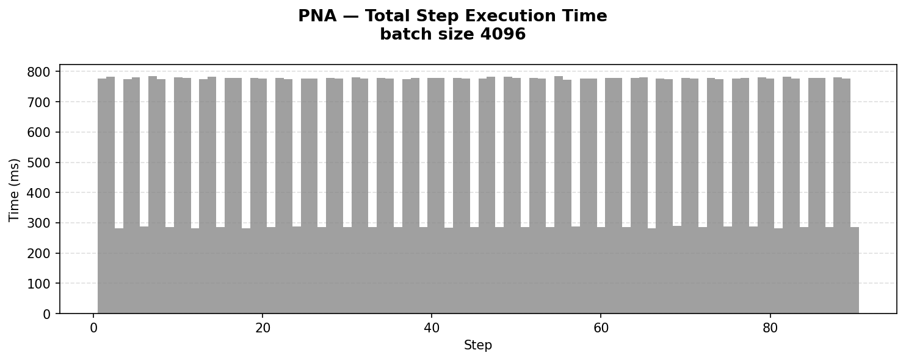

Overlaying the batch-shape metadata immediately reveals the cause — the short steps are simply the **partial final batch** of each epoch:

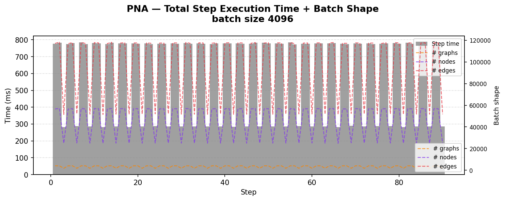

Every third step has roughly half the nodes (~25 000 vs ~57 000) and half the edges (~52 000 vs ~118 000). Since GNN computation scales with the number of nodes and edges, step time scales proportionally. There is no "spike" — the training loop is behaving exactly as expected given the dataset size.

### Time Breakdown

| | |
|:---:|:---:|
| 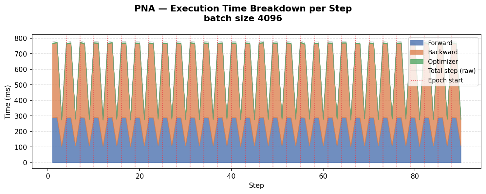 | 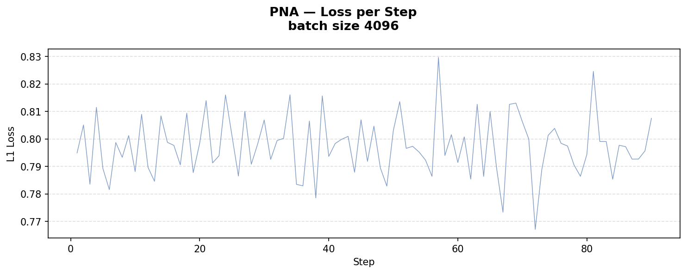 |
| *Execution time breakdown per step* | *Training loss per step* |

<table>
<tr>
<td width="340">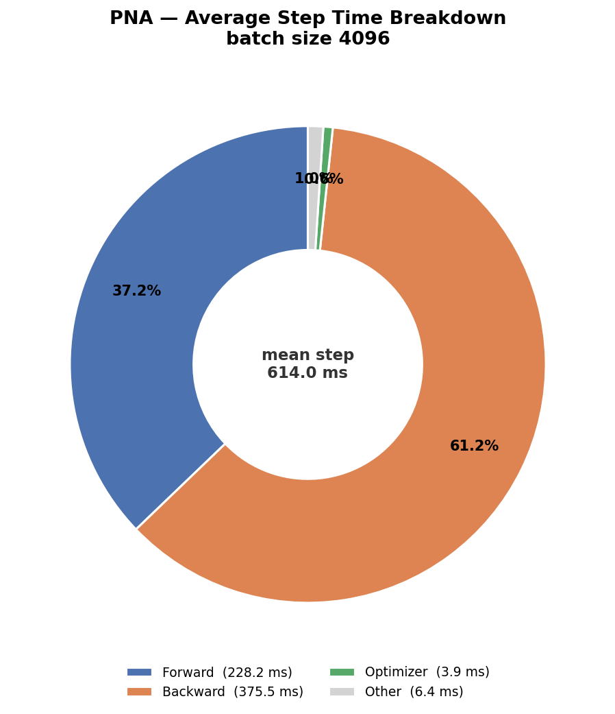</td>
<td valign="top">

The backward pass dominates at **61.2%** of mean step time (375.5 ms), while the forward pass takes **37.2%** (228.2 ms). The optimizer step is negligible at **1.0%** (3.9 ms).

This split is characteristic of deep GNNs: backpropagating gradients through 64 convolution layers over irregular sparse graphs is significantly more expensive than the forward pass. At large batch sizes the backward pass must manage large intermediate tensors across ~57 000 nodes, making gradient accumulation the dominant cost.

</td>
</tr>
</table>

### Hardware Utilisation at Batch Size 4096

| | |
|:---:|:---:|
| 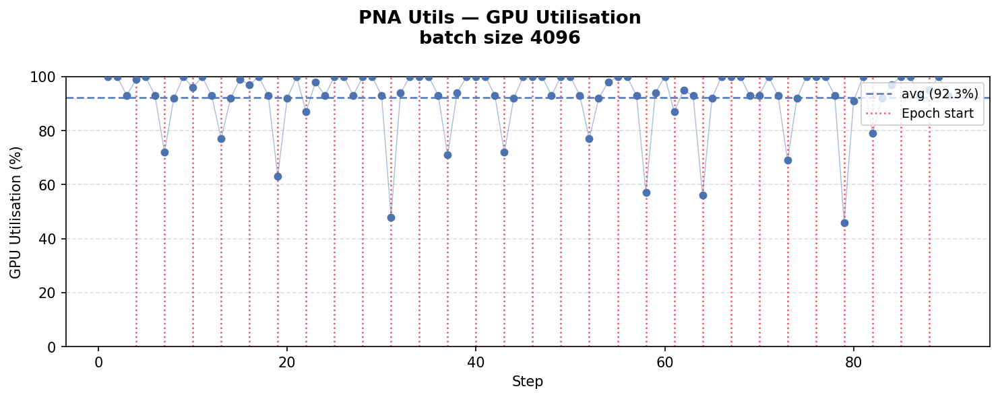 | 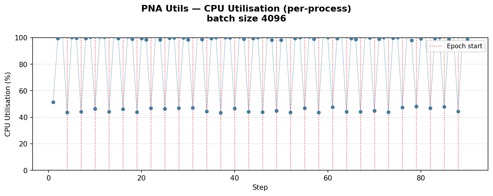 |
| *GPU utilisation — avg 92.3%* | *Per-process CPU utilisation — avg 81.9%* |

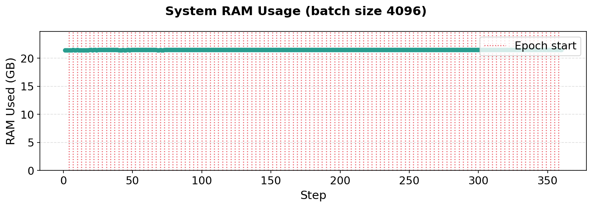

GPU utilisation averages **92.3%** at this batch size — remarkably high for a GNN workload. With 2 DataLoader workers pre-fetching batches, the GPU rarely stalls waiting for data. Each full batch contains ~57 000 nodes and ~118 000 edges, producing CUDA kernels large enough to keep the streaming multiprocessors continuously saturated.

---

## 4. Training at Batch Size 512 — GC Spike Attribution

At batch size 512, each epoch has 20 steps and execution time is far more uniform — except for **periodic spikes** that significantly exceed the ~105 ms baseline:

| | |
|:---:|:---:|
| 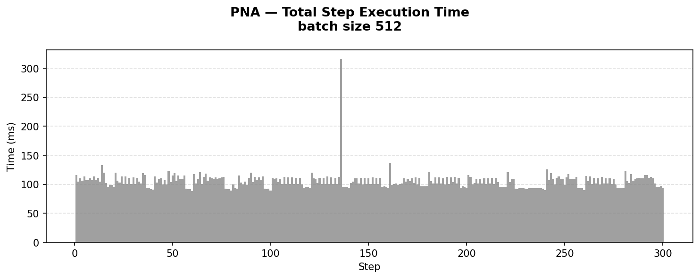 | 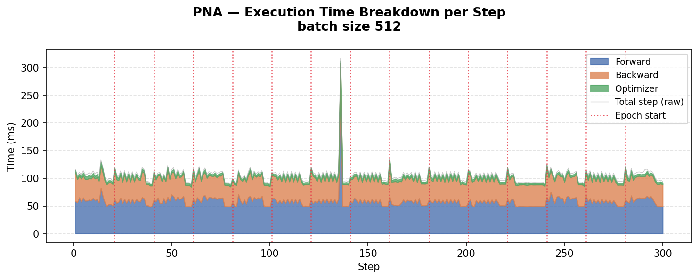 |
| *Step execution time — note the spike* | *Time breakdown — spike appears across all substeps* |

Unlike the batch-shape-driven variation at bs4096, these spikes are caused by **Python's garbage collector**.

### Identifying GC as the Cause

We ran the same workload with GC event logging enabled. Annotating generation-2 collection events onto the time-breakdown reveals the correlation — **spikes align with gen-2 GC sweeps**:

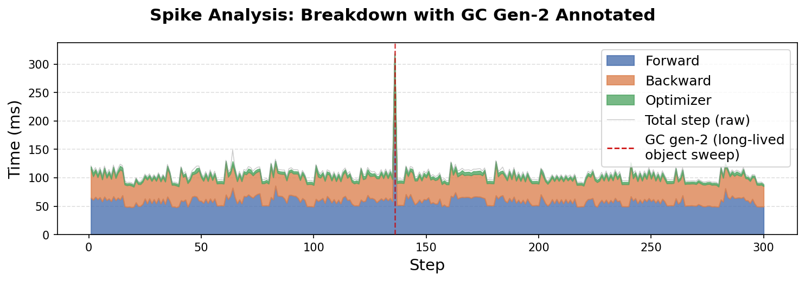

Gen-2 collections pause the process for **130–180 ms**. These pauses are triggered by PyTorch Geometric's `DataLoader`, which creates many short-lived Python objects (graph tensors, batch index tensors) every step. These objects get promoted through Python's generational GC until they trigger a gen-2 sweep.

### Disabling GC Eliminates the Spikes

Running with automatic GC disabled produces a **perfectly flat** execution trace:

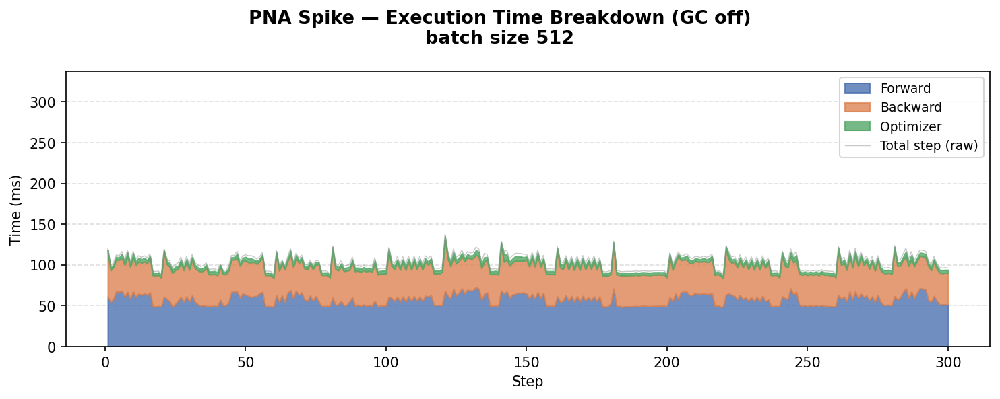

Step time holds steady at ~105 ms with no variation, confirming that GC is the **sole source** of the spikes at this batch size.

<table>
<tr>
<td width="340">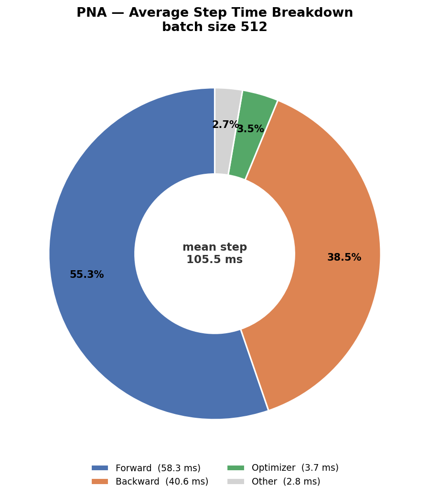</td>
<td valign="top">

At bs512, the time split differs from bs4096: the forward pass takes **55.3%** (58.3 ms) and the backward pass **38.5%** (40.6 ms). This inversion occurs because small batches produce small graphs where the forward aggregation overhead (64 layers of scatter/gather over many small neighbourhoods) dominates relative to the backward pass, which has less intermediate state to accumulate gradients over.

As batch size grows, backward scales super-linearly due to larger intermediate tensors and more complex autograd graph traversal, eventually overtaking the forward pass.

</td>
</tr>
</table>

### The Same GC Pattern Appears at Batch Size 4096

GC events also affect bs4096 training when GC is enabled. The spike experiment at bs4096 confirms this and shows that disabling GC produces an equally flat trace:

| | |
|:---:|:---:|
| 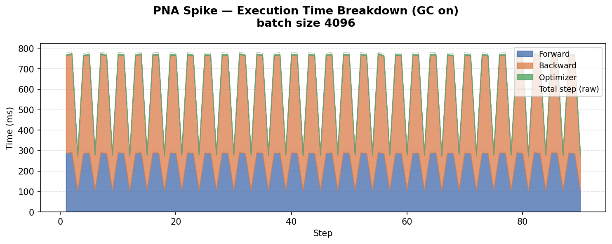 | 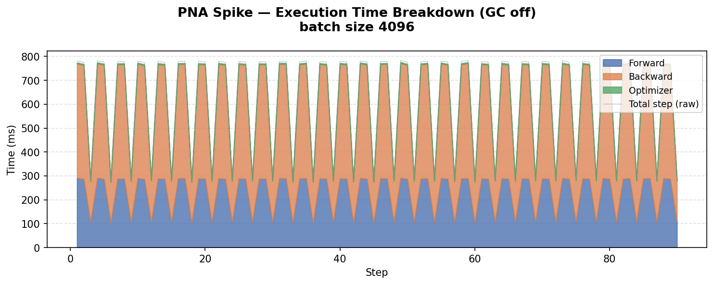 |
| *GC on: variability from gen-2 collections* | *GC off: flat ~775 ms trace* |

---

## 5. Batch-Size Comparison

### Epoch Latency

Despite much longer per-step times, larger batch sizes complete each epoch **faster** because they process the same dataset in fewer steps:

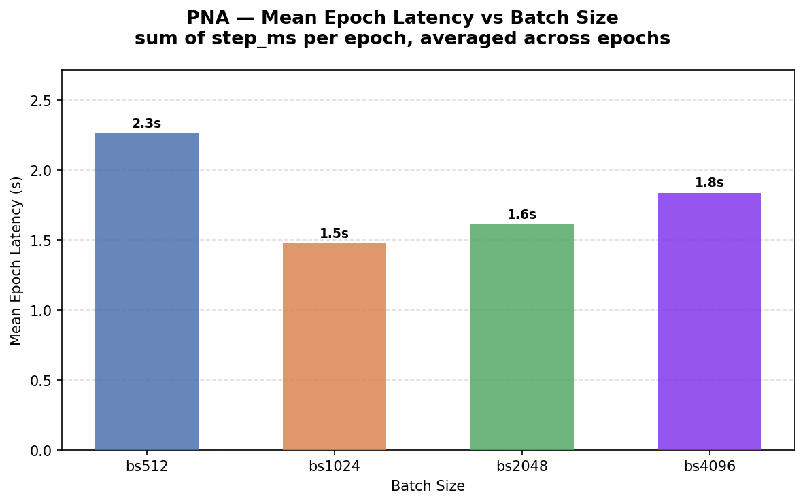

| Batch Size | Mean Step Time | Steps/Epoch | Epoch Latency |
|:----------:|:--------------:|:-----------:|:-------------:|
| 512        | 105 ms         | 20          | **2.1 s**     |
| 1024       | 148 ms         | 10          | **1.5 s**     |
| 2048       | 322 ms         | 5           | **1.6 s**     |
| 4096       | 614 ms         | 3           | **1.8 s**     |

Batch size 1024 achieves the lowest epoch latency (1.5 s). Beyond that, per-step compute grows faster than the step-count reduction, so epoch latency rises slightly — but all larger sizes remain well below bs512.

### GPU Utilisation Scales with Batch Size

With 2 DataLoader workers, GPU utilisation **increases monotonically** with batch size — a clean scaling relationship:

| | |
|:---:|:---:|
|  |  |
| *GPU utilisation scales smoothly from 45% to 92%* | *CPU utilisation remains high across all sizes (81–91%)* |

| Batch Size | GPU Util | CPU Util |
|:----------:|:--------:|:--------:|
| 512        | 44.6%    | 90.8%    |
| 1024       | 55.9%    | 84.0%    |
| 2048       | 63.2%    | 81.4%    |
| 4096       | 92.3%    | 81.9%    |

**Why GPU utilisation increases**: larger batches produce larger batched graphs with more nodes and edges. This creates larger CUDA kernels with higher arithmetic intensity per launch, improving occupancy on the GPU's streaming multiprocessors. At bs4096 (~57 000 nodes, ~118 000 edges per batch), the kernels are large enough to keep the GPU near-continuously busy.

**The role of DataLoader workers**: with `num_workers=2`, data preparation is pipelined with GPU computation. This eliminates the idle gaps that plagued the single-threaded (`num_workers=0`) configuration. The clean monotonic scaling is a direct result of this pipelining — without it, GPU utilisation showed a non-monotonic dip at intermediate batch sizes where the GPU waited for the CPU to finish collating each batch.

**CPU utilisation**: remains high across all batch sizes (81–91%). The main process is consistently loaded by CUDA kernel dispatch, while the 2 worker processes handle data collation in parallel.

### Batch Sizes 1024 and 2048

| | |
|:---:|:---:|
| 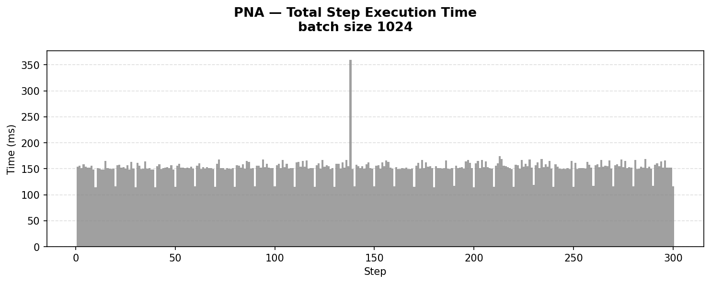 | 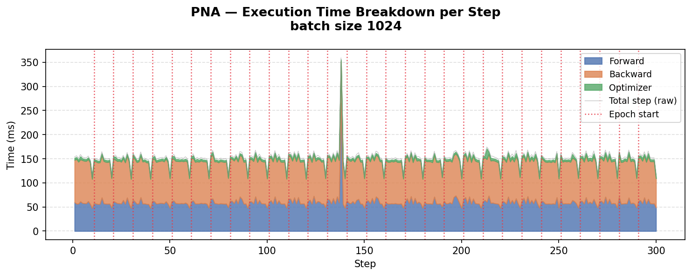 |
| *bs1024: ~148 ms steps* | *bs1024: forward/backward transition zone* |

| | |
|:---:|:---:|
| 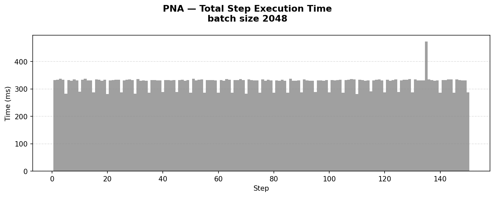 | 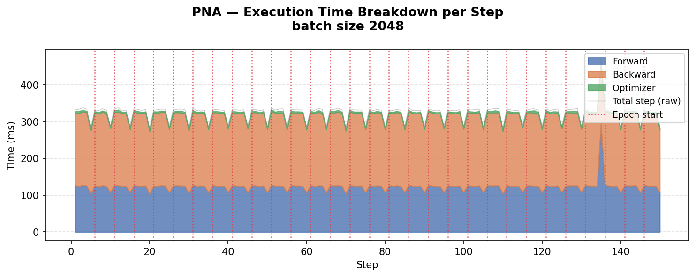 |
| *bs2048: ~322 ms steps, partial-batch dips visible* | *bs2048: backward pass starts dominating* |

These intermediate sizes show a transition: at bs1024 the forward and backward passes are roughly balanced, while at bs2048 the backward pass starts to dominate — reaching the 61/37 split seen at bs4096.

---

## 6. Energy and Carbon

### Energy per Epoch

Energy per epoch varies with batch size, with **bs1024 being the most energy-efficient** configuration:


| Batch Size | Energy/Epoch |
|:----------:|:------------:|
| 512        | 0.314 mWh    |
| 1024       | 0.264 mWh    |
| 2048       | 0.280 mWh    |
| 4096       | 0.310 mWh    |

The sweet spot is at bs1024: it has the fastest epoch latency (1.5 s) and the lowest energy consumption. At bs4096, although GPU utilisation is highest (92.3%), the longer per-step computation outweighs the step-count reduction, pushing total energy back up. The result is a U-shaped energy curve — an important finding for practitioners choosing batch sizes for energy-efficient training.

### Energy Breakdown by Hardware

| | |
|:---:|:---:|
| 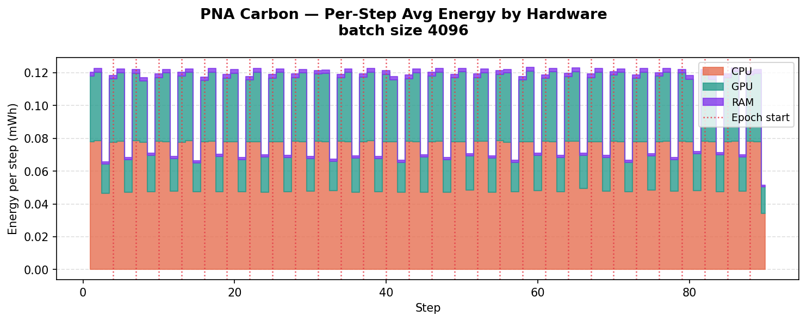 | 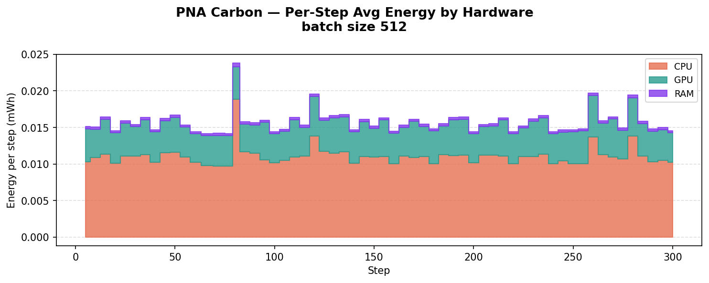 |
| *bs4096: per-step energy by hardware* | *bs512: per-step energy by hardware* |

<table>
<tr>
<td width="340">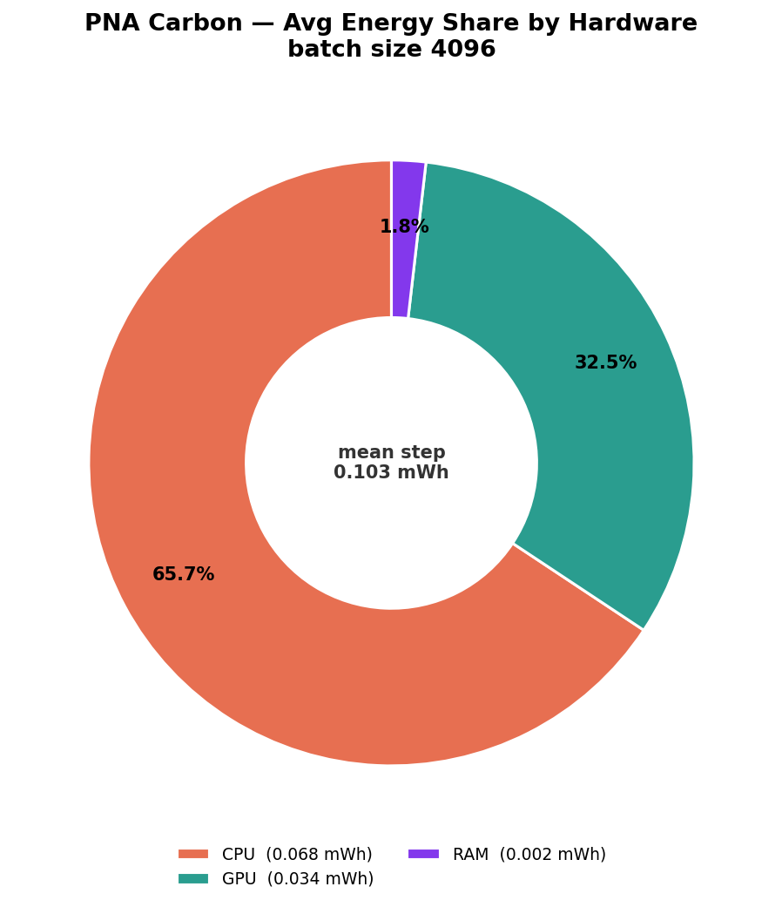</td>
<td valign="top">

At bs4096, the **CPU dominates energy consumption** at **65.6%** (0.068 mWh per step), with the GPU accounting for **32.6%** (0.034 mWh) and RAM a negligible **1.8%**.

Despite the GPU running at 92.3% utilisation, CPU energy still dominates because CodeCarbon attributes CPU power at the constant TDP rate — the full rated thermal design power is charged for every second of wall-clock time. Since each bs4096 step takes ~614 ms, the CPU's constant power draw accumulates substantially.

The practical implication: **reducing wall-clock training time** is the primary lever for reducing both energy consumption and carbon emissions.

</td>
</tr>
</table>

### Energy per Hardware Component Across Batch Sizes

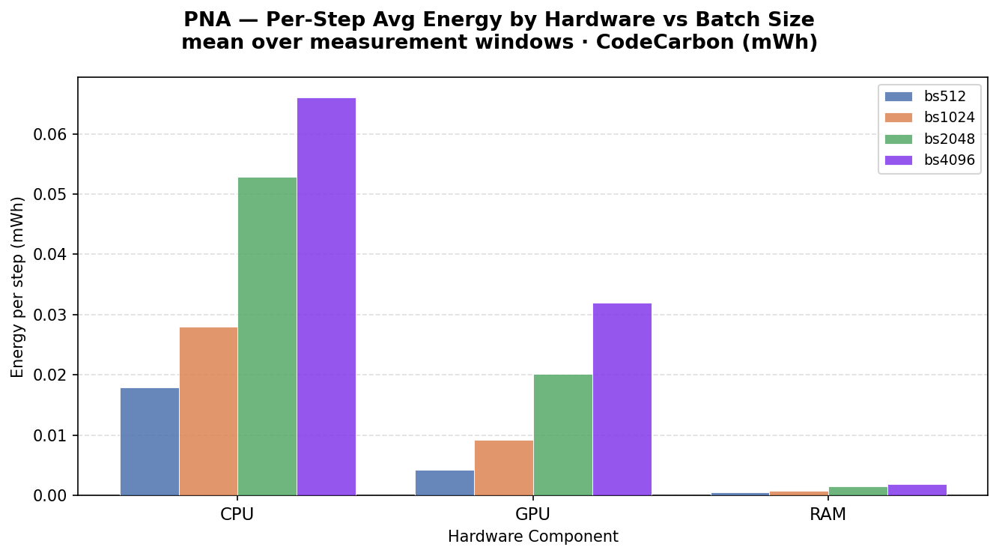

Per-step energy for all hardware components grows with batch size (larger batches = more computation per step), but CPU consistently dominates. The GPU's share increases at larger batch sizes as higher utilisation translates to higher power draw, narrowing the gap with the constant-TDP CPU attribution.

### Per-Step Energy Traces

| | |
|:---:|:---:|
| 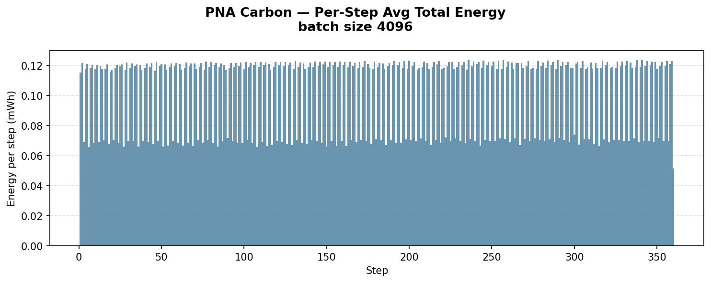 | 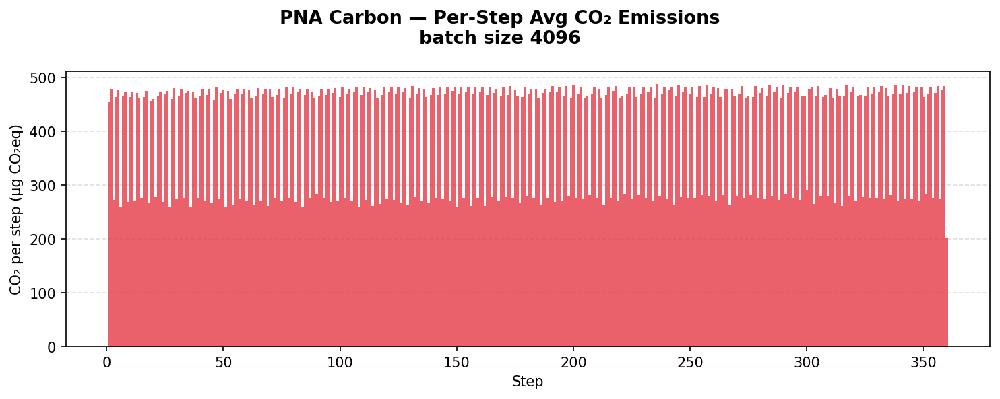 |
| *bs4096: per-step energy (mWh)* | *bs4096: per-step CO₂ emissions (µg CO₂eq)* |

| | |
|:---:|:---:|
| 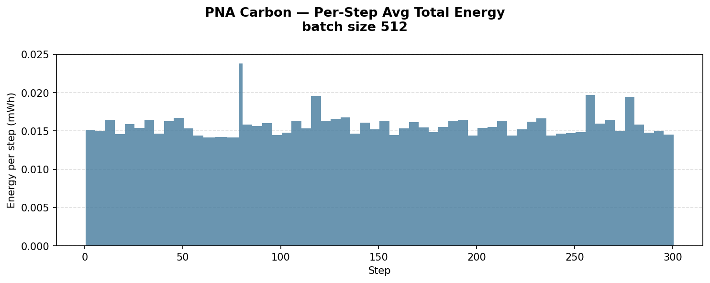 | 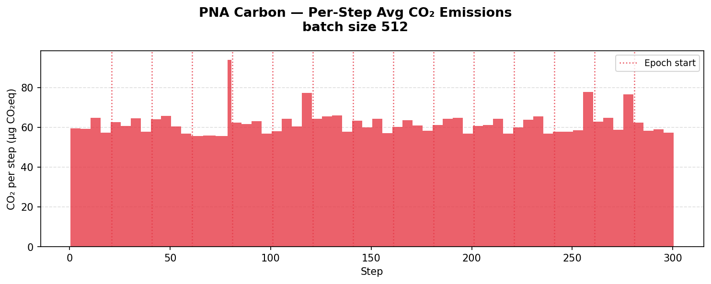 |
| *bs512: per-step energy (mWh)* | *bs512: per-step CO₂ emissions (µg CO₂eq)* |

<table>
<tr>
<td width="340">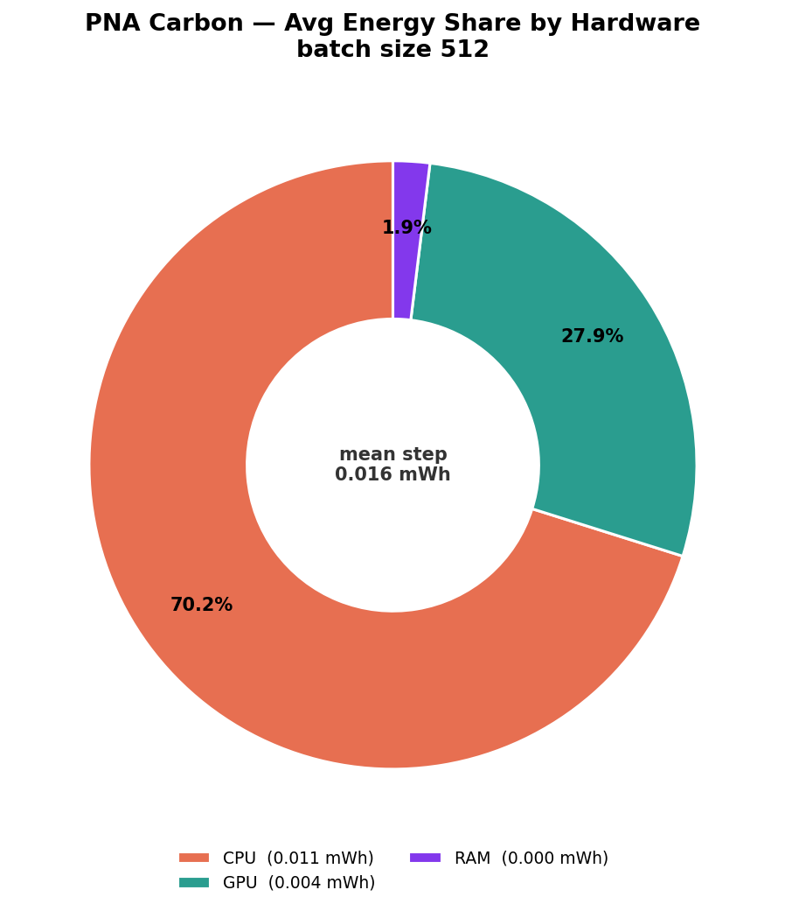</td>
<td valign="top">

At bs512, the CPU's energy dominance is even more pronounced. The GPU operates at 44.6% utilisation — drawing proportionally less power — while the CPU's constant TDP attribution runs at full rate for every millisecond of wall-clock time.

The carbon emissions traces mirror the energy traces exactly (Quebec's grid carbon intensity is a constant factor), so the same conclusions apply: **choosing the right batch size matters for emissions**, and bs1024 is the sweet spot in this configuration.

</td>
</tr>
</table>

---

## 7. Measurement Overhead

Instrumenting training with utilisation sampling and energy tracking adds minimal overhead. At bs4096, mean step latency across configurations:


| Configuration          | Mean Step Latency | Overhead |
|:----------------------:|:-----------------:|:--------:|
| Simple (timers only)   | 614.0 ms          | baseline |
| Util measurement       | 614.8 ms          | +0.1%    |
| Carbon (CodeCarbon)    | 615.9 ms          | +0.3%    |

All instrumentation adds less than **0.3% overhead**, confirming that the measurement tooling does not meaningfully distort any of the results presented in this report.

---

## 8. Summary

1. **Batch size 4096** achieves the highest GPU utilisation (**92.3%**) thanks to large CUDA kernels that saturate the GPU. With 2 DataLoader workers, data pipelining keeps the GPU near-continuously busy.

2. **Batch size 1024** is the energy sweet spot — lowest epoch latency (**1.5 s**) and lowest energy per epoch (**0.264 mWh**). At bs4096, high GPU utilisation doesn't fully compensate for longer steps.

3. **Step-time spikes have different root causes at different batch sizes:**
   - At **bs4096**, the periodic short steps are simply **partial batches** at epoch boundaries (1808 vs 4096 graphs).
   - At **bs512**, spikes are caused by **Python gen-2 garbage collection** pauses of 130–180 ms. Disabling GC eliminates them entirely.

4. **GPU utilisation scales monotonically** with batch size (44.6% → 55.9% → 63.2% → 92.3%) when DataLoader workers are used. This clean scaling is enabled by pipelining data preparation with GPU computation.

5. **CPU energy dominates** at all batch sizes (~66% at bs4096) due to CodeCarbon's constant-TDP attribution model. Reducing wall-clock training time remains the primary lever for cutting carbon emissions.

6. **Measurement overhead is negligible** (<0.3%), so all results can be taken at face value.
