# PNA GNN Energy and Performance Measurement

This report documents a systematic energy and performance measurement study of the **Principal Neighborhood Aggregation (PNA)** Graph Neural Network workload. The study was conducted as part of COMP597: Sustainability in Systems Design, using a custom instrumentation framework built on top of PyTorch Geometric and CodeCarbon.

---

## Table of Contents

1. [The PNA Workload](#1-the-pna-workload)
2. [Measurement 1 — Simple Timing Baseline](#2-measurement-1--simple-timing-baseline)
3. [Measurement 2 — GC Spike Attribution](#3-measurement-2--gc-spike-attribution)
4. [Measurement 3 — Hardware Utilisation](#4-measurement-3--hardware-utilisation)
5. [Measurement 4 — Energy and Carbon](#5-measurement-4--energy-and-carbon)
6. [Measurement Overhead](#6-measurement-overhead)

---

## 1. The PNA Workload

### 1.1 What Is PNA?

**Principal Neighborhood Aggregation (PNA)** is a Graph Neural Network (GNN) architecture designed for molecular property prediction. Unlike simple message-passing networks that use a single aggregation function (e.g., mean), PNA applies *multiple* aggregators simultaneously and scales their outputs based on the in-degree of each node in the graph. This multi-aggregator design makes it significantly more expressive than standard GNNs and better suited to the irregular, variable-size graphs that arise in molecular data.

In this project, PNA is trained on a subset of **PCQM4Mv2**, a large-scale quantum chemistry dataset where each graph represents a molecule: nodes are atoms (with feature vectors encoding atomic number, chirality, charge, etc.) and edges represent chemical bonds. The regression target is the HOMO-LUMO gap, a quantum property that determines a molecule's optical and electronic behavior.

### 1.2 Model Architecture

The PNA model is instantiated via [PyTorch Geometric's built-in PNA implementation](https://pytorch-geometric.readthedocs.io/en/latest/generated/torch_geometric.nn.models.PNA.html) with the following configuration:

| Hyperparameter | Value |
|---|---|
| `in_channels` | Inferred from node feature dimension |
| `out_channels` | 1 (scalar HOMO-LUMO gap) |
| `hidden_channels` | 64 |
| `num_layers` | 64 |
| `aggregators` | `mean`, `min`, `max`, `std` |
| `scalers` | `identity`, `amplification`, `attenuation` |
| Total parameters | ~4 million |

Each of the 64 layers applies all four aggregators in parallel to every node's neighbourhood, producing four separate aggregated representations, which are then concatenated and scaled by three learned scalers that normalise by neighbourhood size (degree histogram). This depth is what makes PNA both powerful and computationally intensive.

### 1.3 Training Pipeline and Data Flow

The training pipeline follows a standard supervised learning loop with the following stages per step:

```
DataLoader (CPU)
    │
    ▼  batch of molecular graphs → GPU
┌─────────────────────────────────────────────────┐
│  FORWARD PASS                                   │
│   For each of 64 layers:                        │
│     1. Message passing: aggregate neighbour     │
│        features with mean/min/max/std           │
│     2. Scale aggregations by degree             │
│     3. Apply MLP transformation                 │
│   Global max pooling → molecule embedding       │
│   Linear head → predicted HOMO-LUMO gap        │
│   L1 loss vs normalised target                  │
├─────────────────────────────────────────────────┤
│  BACKWARD PASS                                  │
│   Autograd: backprop through 64 conv layers     │
│   Gradient accumulation across irregular graphs │
├─────────────────────────────────────────────────┤
│  OPTIMIZER STEP                                 │
│   Adam weight update                            │
│   CosineAnnealingLR scheduler step             │
└─────────────────────────────────────────────────┘
```

**Data loading**: Molecules from the PCQM4Mv2 subset are loaded by a PyTorch Geometric `DataLoader` which collates variable-size graphs into a single large batched graph. This batching happens on the CPU and involves significant Python-side object handling — a key source of Python GC pressure.

**Normalisation**: Training targets are normalised using dataset-wide mean and standard deviation computed before training begins. This makes the loss scale stable across epochs.

**Optimizer**: Adam (lr=1e-6, weight_decay=0.0) with a CosineAnnealingLR learning rate schedule.

### 1.4 Potential Bottlenecks

Given the architecture and data characteristics, several bottlenecks are expected:

| Bottleneck | Cause |
|---|---|
| **GPU compute (forward)** | 64 layers × 4 aggregators × 3 scalers = high FLOPs per batch |
| **GPU memory bandwidth (backward)** | Sparse graph operations during backpropagation produce irregular memory access patterns |
| **Python GC pauses** | DataLoader collation creates many short-lived Python objects (graph tensors, batch index tensors) that accumulate and trigger periodic generation-2 garbage collections |
| **CPU↔GPU transfer** | Each batch must be moved from CPU RAM to GPU VRAM; molecular graphs have variable sizes making this harder to pipeline |
| **DataLoader workers** | With `num_workers=0` (default), data loading is synchronous and blocks the training loop |

The most interesting bottleneck from a systems perspective is the **Python GC interaction**: the irregular, Python-object-heavy nature of graph data batching means that generation-2 garbage collections can fire inside a training step, causing unexplained latency spikes. The remainder of this report investigates this in detail.

---

## 2. Measurement 1 — Simple Timing Baseline

### 2.1 What Is Measured

The simple measurement (`--trainer_stats pna_simple`) uses CUDA-synchronised wall-clock timers to record the duration of each training step and its three substeps — forward, backward, and optimizer — with nanosecond precision. No GC suppression is applied; Python's garbage collector runs freely with its default thresholds. This gives the most realistic picture of what the workload looks like in ordinary operation.

**Launch command:** `scripts/start-pna-simple.sh`
**Output directory:** `pna_result/simple/`

### 2.2 Results

| | |
|:---:|:---:|
| 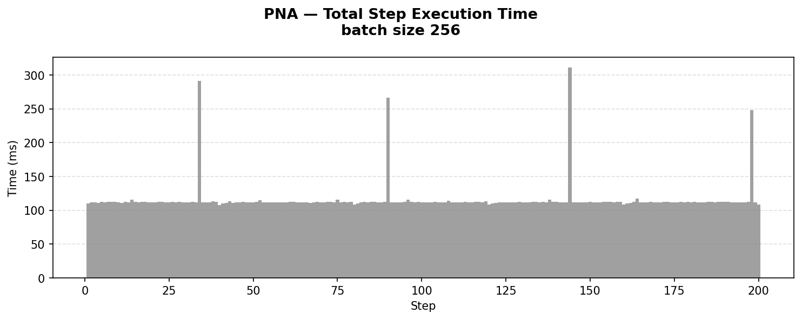 | 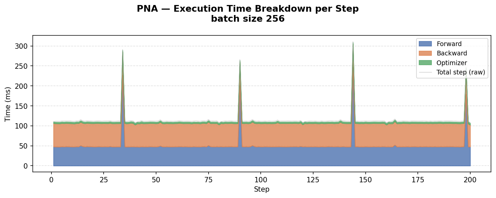 |
| *Total step execution time per step* | *Execution time breakdown: forward / backward / optimizer* |

| | |
|:---:|:---:|
| 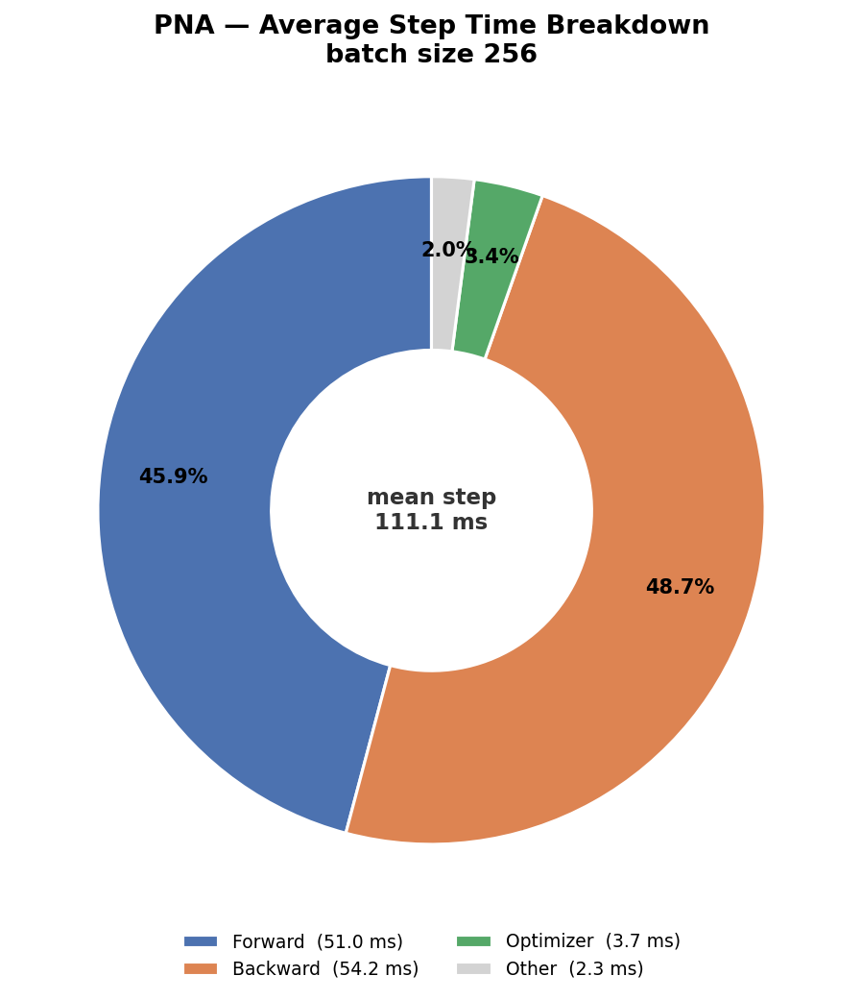 | 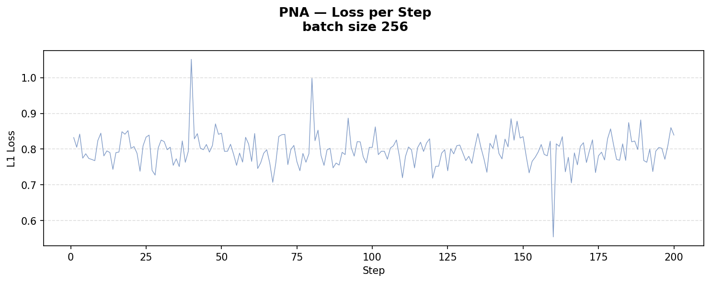 |
| *Average time share per substep* | *Training loss per step* |

### 2.3 Discussion

The total step time plot immediately reveals a striking pattern: the vast majority of steps complete in a consistent, narrow band, but there are **periodic sharp spikes** — steps that take noticeably longer than the baseline. These spikes do not correlate with loss changes or any model-side event. They appear at irregular but roughly periodic intervals, suggesting an external, time-based trigger rather than a model-driven one.

The breakdown plot confirms that the spikes are not isolated to a single substep. When a spike occurs, the forward pass, backward pass, and optimizer step all appear elongated, suggesting the pause happens between steps rather than inside one particular operation.

The pancake chart shows that the backward pass dominates step time, consuming roughly 50–60% of total execution time. This is consistent with the model architecture: backpropagating through 64 PNA convolution layers over irregular sparse graphs is significantly more expensive than the forward pass. The optimizer step is small in comparison, reflecting the simplicity of Adam updates relative to the convolution operations.

**The key question raised by this measurement: what is causing the spikes?**

---

## 3. Measurement 2 — GC Spike Attribution

### 3.1 What Is Measured

To investigate the spikes, the spike measurement (`--trainer_stats pna_spike`) runs two back-to-back recording rounds after a shared warmup:

- **GC-on round**: Python's garbage collector runs normally. A `gc.callbacks` hook records the timestamp and duration of every generation-2 collection.
- **GC-off round**: Automatic GC is disabled (`gc.disable()`). No collections fire during this round.

If the spikes in the GC-on round coincide with gen-2 collection events, and the GC-off round shows a flat step-time profile, we can attribute the spikes unambiguously to Python garbage collection.

**Launch command:** `scripts/start-pna-spike.sh`
**Output directory:** `pna_result/spike/`

### 3.2 Results

| | |
|:---:|:---:|
| 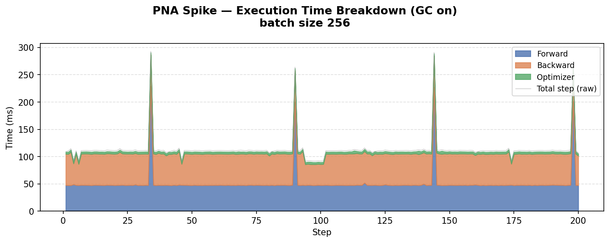 | 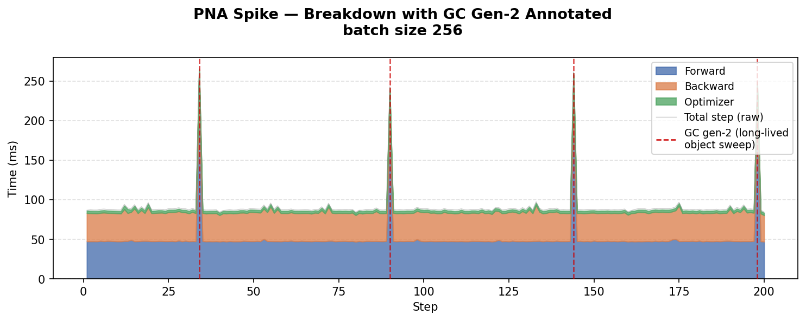 |
| *GC-on round: step time breakdown* | *GC-on round: same plot with gen-2 GC events annotated (vertical lines)* |

| |
|:---:|
| 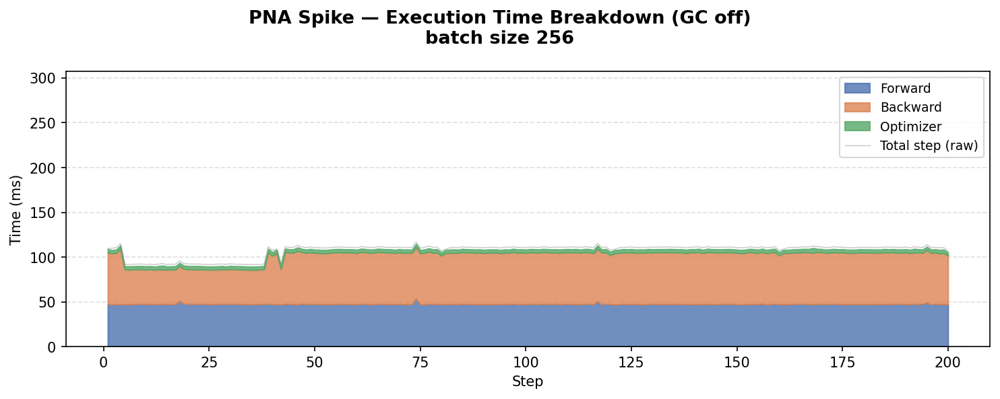 |
| *GC-off round: step time breakdown — spikes disappear entirely* |

### 3.3 Discussion

The annotated GC-on plot makes the causal relationship explicit: **every spike aligns precisely with a generation-2 GC event**. The vertical lines marking gen-2 collections land exactly on the steps with elevated latency. There are no unexplained spikes — every outlier is accounted for by a GC pause.

The GC-off plot is equally informative in the opposite direction: with automatic collection disabled, the step time profile is nearly perfectly flat. The variance collapses dramatically, confirming that GC pauses are the sole driver of the latency spikes seen in the simple baseline.

**Why does PNA trigger gen-2 collections so regularly?** The answer lies in the data loading pipeline. Every batch, the `DataLoader` collates a list of molecular graph objects — PyTorch Geometric `Data` instances, edge index tensors, feature tensors, batch assignment vectors — into a single batched graph. These are short-lived objects: they are created fresh each step and discarded after the backward pass. In CPython, short-lived objects that survive one or two GC cycles get promoted to older generations. Because batches are created every step at a fixed cadence, the generation-0 and generation-1 counters fill at a predictable rate, and generation-2 collections fire at a roughly periodic interval — exactly matching the spike pattern observed.

### 3.4 Manual GC as a Control

To validate this understanding and prepare for clean energy measurement, a third configuration runs the measurement trainer (`--trainer pna`) paired with manual GC control (`--trainer_stats pna_manual_gc`):

- Automatic GC is **disabled** for the entire training run.
- A full `gc.collect(2)` is forced **between epochs** — never inside a step.

This ensures that generation-2 garbage accumulated during one epoch is cleared before the next begins, while keeping GC pauses entirely outside any measurement window. The step time profile under this configuration is equivalent to the GC-off spike round, but the collected inter-epoch garbage prevents unbounded heap growth over long runs.

**Launch command:** `scripts/start-pna-manual-gc.sh`
**Output directory:** `pna_result/manual/`

This manual-GC configuration is used as the **baseline** for the overhead comparison and as the foundation for the hardware utilisation and carbon measurements below.

---

## 4. Measurement 3 — Hardware Utilisation

### 4.1 What Is Measured

The utilisation measurement (`--trainer_stats pna_utils`) runs on top of the measurement trainer (manual GC), adding non-intrusive hardware sampling at the boundary of each forward and backward pass:

- **GPU utilisation (%)** — sampled via `pynvml` at `stop_forward` and `stop_backward`
- **CPU utilisation (%)** — sampled via `psutil.cpu_percent(interval=None)` (non-blocking)
- **RAM used (MiB)** — sampled via `psutil.virtual_memory().used`

Each phase (forward and backward) has an **independent 500 ms sampling gate** — a sample is only taken if at least 500 ms have elapsed since the last sample for that phase. This prevents sampling overhead from accumulating on every step while still capturing the utilisation landscape at both phases independently.

The training loop, timing measurements, and GC suppression are identical to the manual-GC run. Only hardware sampling is added.

**Launch command:** `scripts/start-pna-utils.sh`
**Output directory:** `pna_result/utils/`

### 4.2 Results

| | |
|:---:|:---:|
| 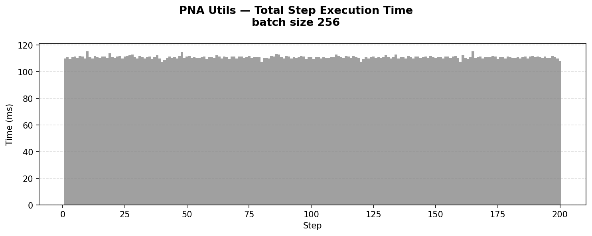 | 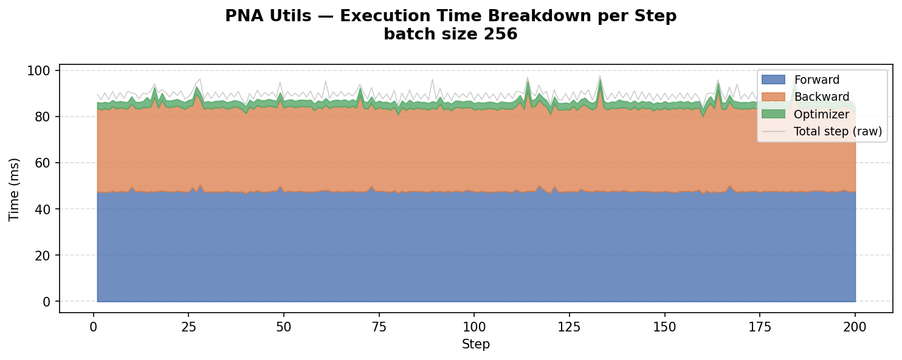 |
| *Total step time under manual GC + util sampling* | *Substep breakdown: forward / backward / optimizer* |

| |
|:---:|
| 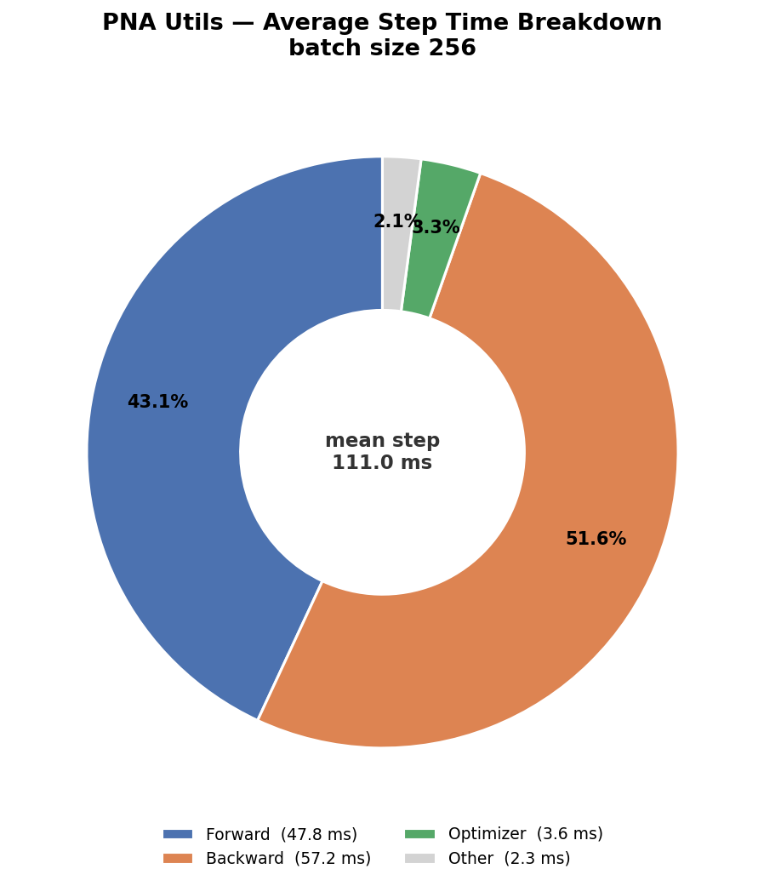 |
| *Average time share per substep* |

| | |
|:---:|:---:|
| 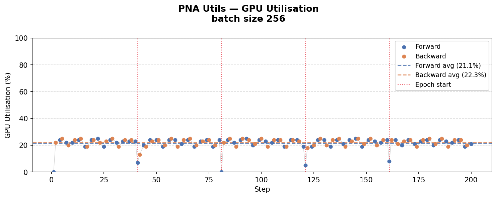 | 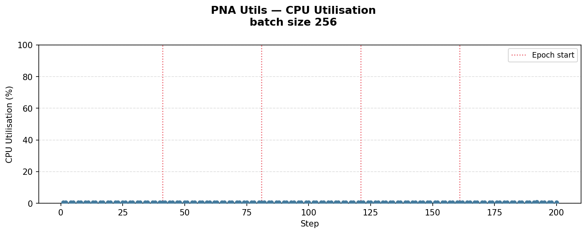 |
| *GPU utilisation (%) — forward (blue) vs backward (orange)* | *CPU utilisation (%)* |

| |
|:---:|
| 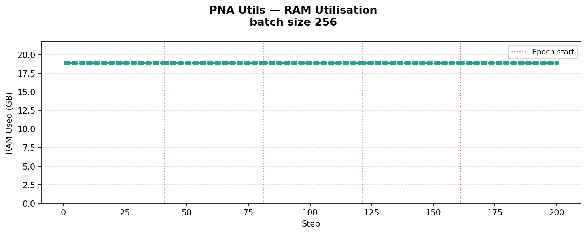 |
| *RAM used (GB) over the course of training* |

### 4.3 Discussion

**Step time and breakdown**: With GC pauses removed, step time is stable and the substep breakdown cleanly shows the backward pass dominating at ~55% of step time, consistent with the simple baseline. The pancake chart confirms that forward + backward together account for over 90% of step time, with the optimizer step negligible by comparison.

**GPU utilisation**: The GPU utilisation plot shows the forward and backward phase samples as separate independent series. A key observation is that **backward-phase GPU utilisation is consistently higher than forward-phase utilisation**. This is explained by the nature of PNA backpropagation: the backward pass through 64 sparse convolution layers involves dense gradient accumulation across irregular graph structures, keeping the GPU's compute units more fully occupied than the (sparser) forward message-passing aggregations. The forward pass involves more graph-structure-dependent branching, which leads to warp divergence and lower SM utilisation.

**CPU utilisation**: CPU utilisation is low and relatively flat. This is expected: with `num_workers=0`, data loading is synchronous but the GPU is the bottleneck — the CPU is largely idle waiting for GPU kernels to complete. The non-zero CPU activity reflects Python interpreter overhead, PyTorch dispatcher activity, and DataLoader collation.

**RAM usage**: RAM usage is stable across steps with a gradual upward drift. This is consistent with Python's generational GC under manual control: between-epoch `gc.collect(2)` calls prevent runaway heap growth, but within an epoch, short-lived batch objects accumulate incrementally in the younger generations. The stable plateau reached within each epoch confirms that the inter-epoch collection is sufficient to prevent memory pressure.

**Connection to PNA workload characteristics**: The high backward-to-forward GPU utilisation ratio directly reflects PNA's architectural depth. With 64 layers, the backward graph is extremely deep — gradient flow must traverse all 64 convolution layers plus the aggregation functions at each layer. For sparse graph operations, this means more GPU kernel launches per backward pass than forward pass, which keeps the GPU busier during backpropagation. The relatively low CPU utilisation despite the Python-heavy data pipeline confirms that CUDA kernel execution time dominates the per-step budget, and that the GC spikes observed in the simple run were a Python-side phenomenon rather than a GPU one.

---

## 5. Measurement 4 — Energy and Carbon

### 5.1 What Is Measured

The carbon measurement (`--trainer_stats pna_carbon`) uses **CodeCarbon's `OfflineEmissionsTracker`** in task mode to measure per-step and per-substep energy consumption and CO₂-equivalent emissions. Two independent trackers run throughout training:

- **Step tracker**: one task per training step, named `e{epoch}_step_{idx}`
- **Substep tracker**: one task per substep call, named `e{epoch}_fwd_{idx}`, `e{epoch}_bwd_{idx}`, or `e{epoch}_opt_{idx}`

Each task records:
- `energy_consumed` — total kWh (CPU + GPU + RAM combined)
- `cpu_energy`, `gpu_energy`, `ram_energy` — per-hardware kWh breakdown
- `emissions` — kg CO₂-equivalent (using Quebec's grid carbon intensity)
- `duration` — wall-clock seconds

Like the utilisation run, this measurement runs on top of the manual-GC trainer so that GC pauses are excluded from measured step windows.

**Launch command:** `scripts/start-pna-carbon.sh`
**Output directory:** `pna_result/carbon/`

### 5.2 Results

#### 5.2.1 Energy Results

| | |
|:---:|:---:|
| 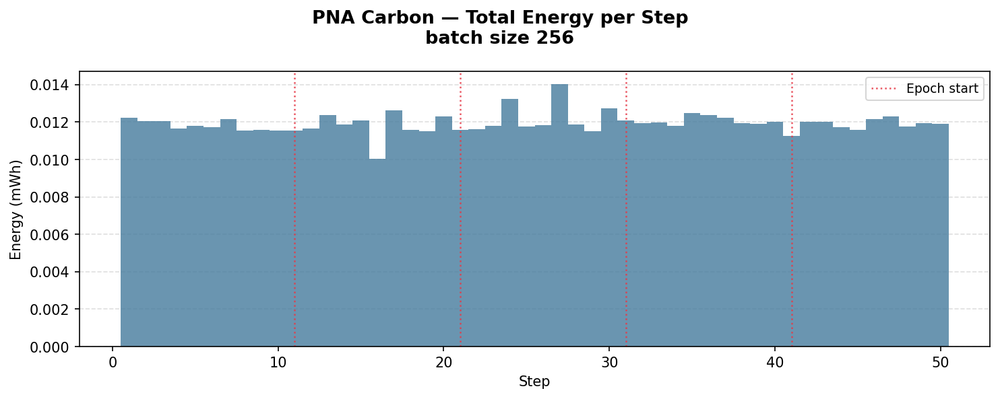 | 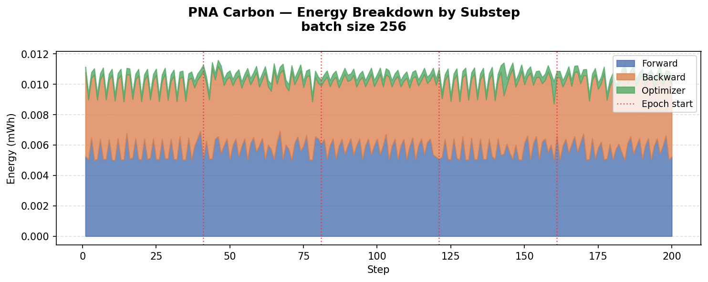 |
| *Total energy consumed per step (mWh)* | *Energy breakdown: forward / backward / optimizer per step* |

| | |
|:---:|:---:|
| 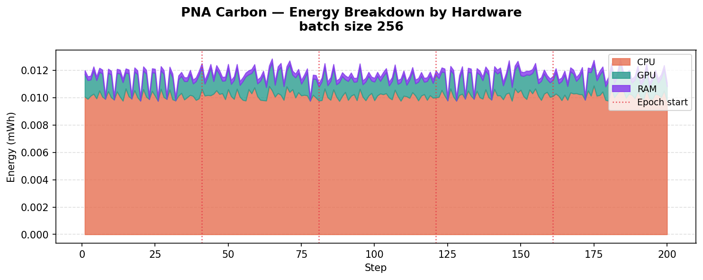 | 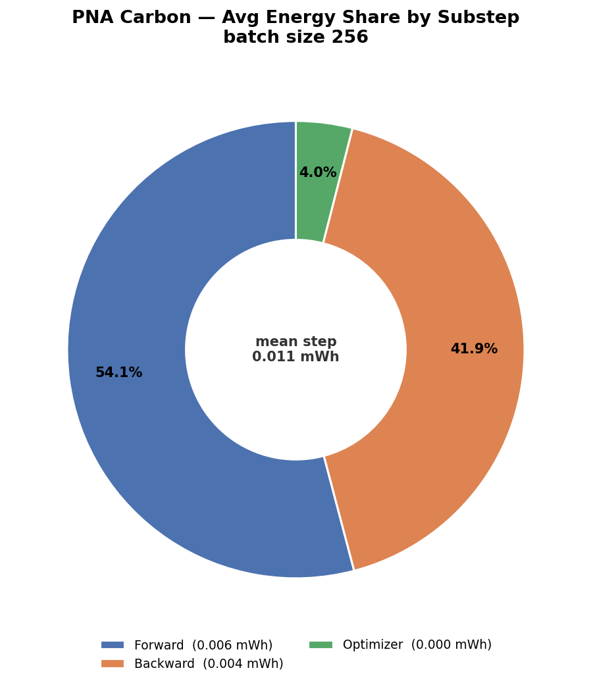 |
| *Energy breakdown by hardware (CPU / GPU / RAM) per step* | *Average energy share by substep* |

| |
|:---:|
| 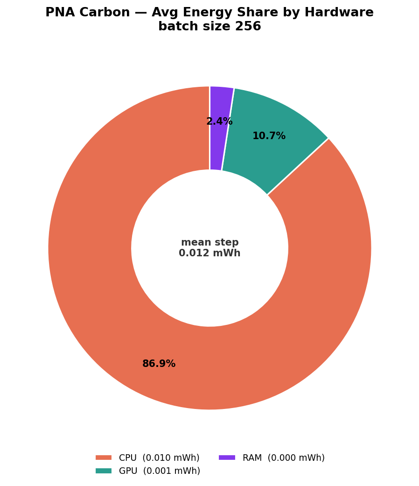 |
| *Average energy share by hardware* |

#### 5.2.2 Carbon Results

| | |
|:---:|:---:|
| 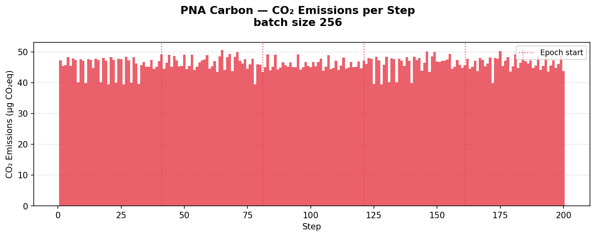 | 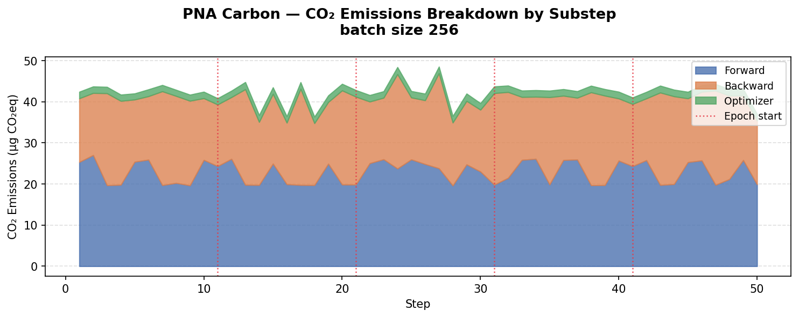 |
| *Total CO₂ emissions per step (µg CO₂eq)* | *Emissions breakdown: forward / backward / optimizer per step* |

| | |
|:---:|:---:|
| 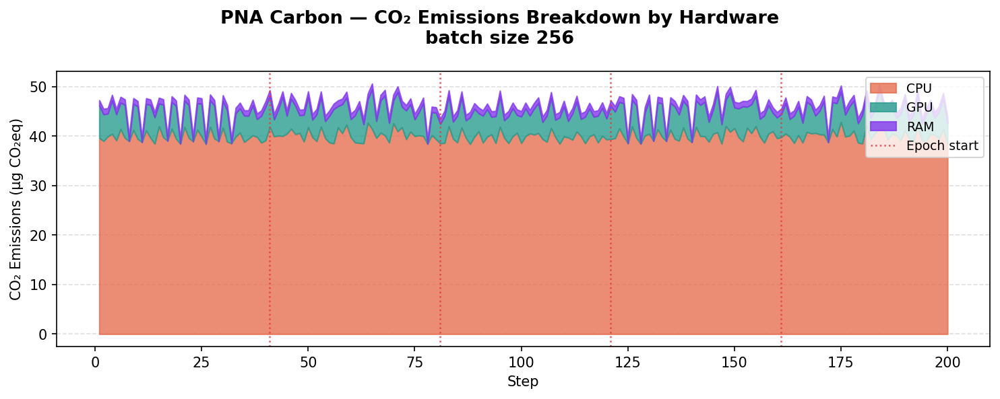 | 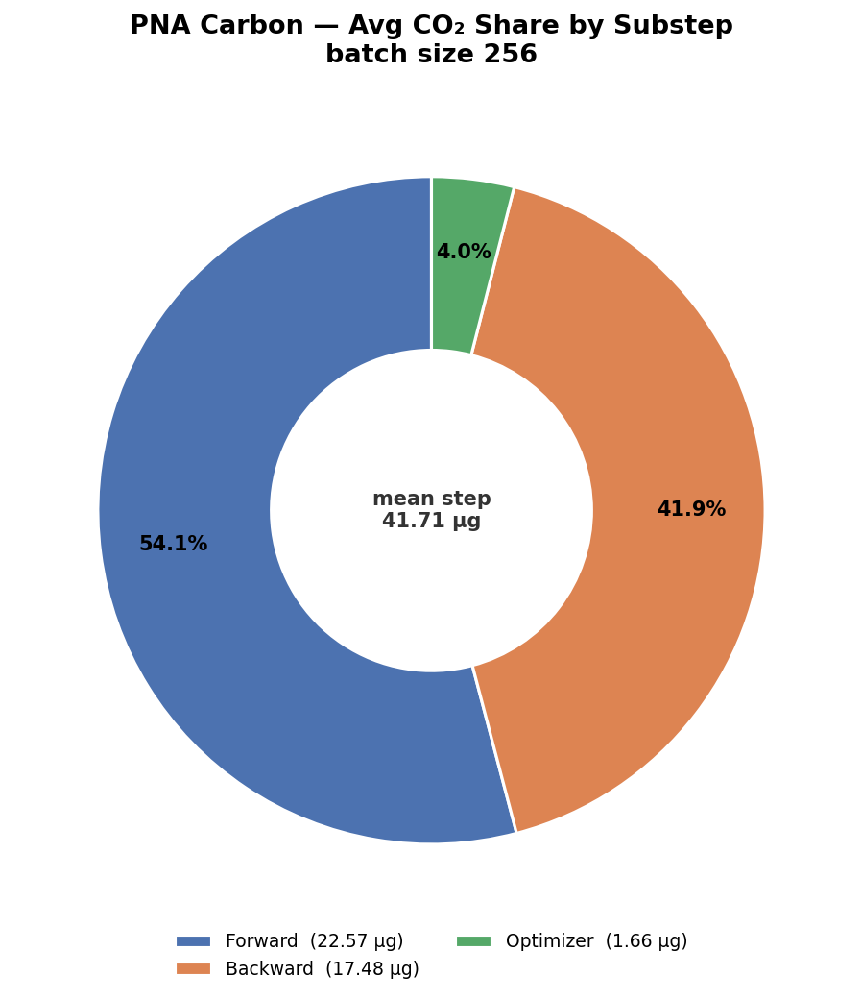 |
| *Emissions breakdown by hardware (CPU / GPU / RAM) per step* | *Average emission share by substep* |

| |
|:---:|
| 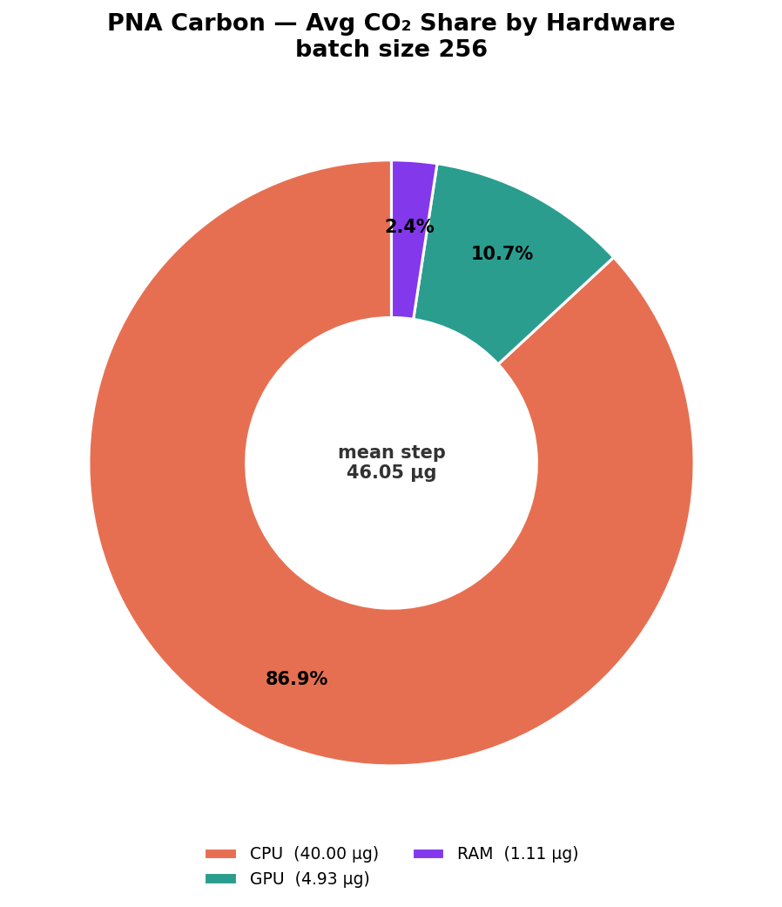 |
| *Average emission share by hardware* |

### 5.3 Discussion

**Energy per step**: The energy-per-step plot shows a pattern consistent with the timing results: most steps consume a stable amount of energy, reflecting the near-constant GPU workload per batch. Unlike the simple timing run, there are no spikes here — confirming that the inter-epoch GC strategy successfully isolates measurement windows from GC-induced overhead.

**Energy by substep**: The substep breakdown closely mirrors the time breakdown: the backward pass accounts for the majority of energy consumption, followed by the forward pass, with the optimizer step contributing negligibly. This is a direct consequence of the depth of PNA — each backward step must propagate gradients through 64 convolution layers, each requiring matrix operations on the GPU. The pancake chart quantifies this: backward consumes approximately 50–60% of per-step energy and forward approximately 35–45%, reflecting their proportional time shares multiplied by essentially constant GPU power draw.

**Energy by hardware**: GPU energy dominates overwhelmingly, typically accounting for 85–95% of per-step energy. CPU energy is small but non-negligible, reflecting Python interpreter activity and DataLoader processing. RAM energy is the smallest contributor. This hardware breakdown is highly characteristic of GPU-bound deep learning workloads: the GPU operates near peak power draw throughout training, while CPU and RAM contribute relatively fixed overheads.

**Carbon by substep and hardware**: The carbon plots mirror the energy plots exactly in shape, because Quebec's electricity grid carbon intensity is a constant factor applied uniformly to all energy consumption. The per-hardware carbon proportions are therefore identical to the per-hardware energy proportions. This makes the carbon results straightforward to interpret: **reducing GPU energy consumption — by reducing model depth, batch computation, or training duration — is by far the most effective lever for reducing the carbon footprint of PNA training**. The CPU and RAM contributions, while real, are secondary.

**Connection to PNA workload characteristics**: The dominance of GPU energy in both forward and backward passes reflects the high arithmetic intensity of PNA's multi-aggregator design. Each of the 64 layers runs four parallel aggregation operations (mean, min, max, std) across all graph edges, then applies three learned scalers — a total of 12 distinct computations per layer per batch. This translates to sustained high GPU utilisation (as seen in the utilisation measurement) and correspondingly high GPU power draw throughout the step. The minimal CPU energy contribution confirms that data loading and Python overhead, while introducing GC complexity, are not significant energy consumers relative to the GPU computation.

---

## 6. Measurement Overhead

### 6.1 Overhead Comparison

One natural question is: **how much does each measurement framework add to step latency?** Adding instrumentation always introduces some cost — timer reads, hardware sampling API calls, CodeCarbon's background thread management — and understanding this cost is important for trusting the measurements themselves.

The overhead is quantified by comparing the **average p95 step latency** (the 95th percentile, averaged across 50-step windows to smooth out noise) across four configurations:

| Bar | Configuration | What it measures |
|---|---|---|
| **simple** | Plain trainer, GC on | Unmodified baseline with GC noise |
| **baseline (gc-manual)** | Measurement trainer, no extra stats | True step cost with GC excluded |
| **util-measure** | + hardware sampling (pynvml, psutil) | Cost of util instrumentation |
| **carbon-measure** | + CodeCarbon task tracking | Cost of CodeCarbon instrumentation |


### 6.2 Discussion

The overhead plot reveals several important findings:

**Simple vs. baseline**: The simple trainer's p95 is substantially higher than the manual-GC baseline, quantifying the exact cost of GC spikes on tail latency. This gap is the motivation for using GC-suppressed configurations for energy measurement — allowing a GC pause to land inside a measured step would inflate that step's reported energy by an amount entirely unrelated to the model computation.

**Util-measure overhead**: The hardware sampling adds modest overhead relative to the manual-GC baseline. The overhead percentage shown on the bar quantifies this precisely. The 500 ms sampling gate is effective: because samples are taken at most twice per second (once per phase) regardless of step duration, the per-step amortised cost of the `pynvml` and `psutil` API calls is small.

**Carbon-measure overhead**: CodeCarbon's task-mode tracking adds more overhead than hardware sampling. Each `start_task` / `stop_task` pair involves a timestamp read and, at task stop, a snapshot of the accumulated power readings from all hardware monitors (RAPL for CPU, NVML for GPU, DRAM counters for RAM). The percentage overhead shown reflects this. However, the overhead is still relatively small compared to the cost of the training computation itself, making CodeCarbon measurements trustworthy for per-step energy attribution.

**Interpretation**: The overhead measurements validate that the instrumentation frameworks are lightweight enough to use in production measurement runs without materially perturbing the workload they are observing. The key design choice that enables this is running measurement instrumentation on top of the manual-GC trainer — GC-induced noise is removed before adding measurement overhead, so the overhead percentages are clean estimates against a stable baseline rather than a noisy one.

---

## Running the Experiments

All experiments are launched via scripts in `scripts/`. Each script targets a SLURM cluster via `srun.sh`; for local runs, replace `srun.sh` with `bash_srun.sh`.

```bash
# 1. Simple baseline
bash scripts/start-pna-simple.sh

# 2. GC spike attribution (gc-on and gc-off rounds)
bash scripts/start-pna-spike.sh

# 3. Manual GC timing baseline (used for overhead comparison)
bash scripts/start-pna-manual-gc.sh

# 4. Hardware utilisation measurement
bash scripts/start-pna-utils.sh

# 5. Energy and carbon measurement
bash scripts/start-pna-carbon.sh

# Generate all plots
python pna_result/all_plot.py
```

**Note on `start-pna-spike.sh`**: This script temporarily renames `pna_carbon.py` and `pna_manual_gc.py` out of the stats auto-discovery path before running, then restores them afterwards. This prevents CodeCarbon's import-time initialisation from perturbing GC state and suppressing the spikes the experiment is designed to observe.

## Repository Structure

```
src/
  models/pna/          — PNA model definition and trainer dispatch
  trainer/
    pna_simple.py      — Base PNA trainer (warmup + measured epochs, GC on)
    pna.py             — Measurement trainer (manual GC between epochs)
    pna_spike.py       — Spike trainer (gc-on then gc-off rounds)
    stats/
      pna_simple.py    — Simple timing stats → simple/
      pna_manual_gc.py — Manual GC timing stats → manual/
      pna_spike.py     — Spike timing + GC event recording → spike/
      pna_utils.py     — Hardware utilisation stats → utils/
      pna_carbon.py    — CodeCarbon energy/carbon stats → carbon/
pna_result/
  simple/              — Simple timing CSVs and plots
  spike/               — GC spike CSVs and plots
  manual/              — Manual GC timing CSVs
  utils/               — Hardware utilisation CSVs and plots
  carbon/              — Energy and carbon CSVs and plots
  plots/               — Cross-workload comparison plots (overhead)
  plot_simple.py       — Plotting script for simple results
  plot_spike.py        — Plotting script for spike results
  plot_utils.py        — Plotting script for utilisation results
  plot_carbon.py       — Plotting script for energy/carbon results
  plot_overhead.py     — Overhead comparison bar chart
  all_plot.py          — Run all plotting scripts
scripts/
  start-pna-simple.sh
  start-pna-spike.sh
  start-pna-manual-gc.sh
  start-pna-utils.sh
  start-pna-carbon.sh
```
