# PNA GNN: Performance, Energy, and Efficiency Analysis

This report presents a profiling study of the **Principal Neighbourhood Aggregation (PNA)** graph neural network trained on a molecular property prediction task. We examine how batch size affects training latency, GPU utilization, and energy consumption, and investigate the sources of step-time variability at different operating points.

---

## Table of Contents

1. [Workload Overview](#1-workload-overview)
2. [Experiment Setup](#2-experiment-setup)
3. [Raw Measurement](#3-raw-measurement)
4. [Spike Analysis](#4-spike-analysis)
5. [Manual GC Baseline](#5-manual-gc-baseline)
6. [Hardware Utilization](#6-hardware-utilization)
7. [Energy and Carbon](#7-energy-and-carbon)
8. [Varying DataLoader Workers](#8-varying-dataloader-workers)
9. [Summary](#9-summary)

---

## 1. Workload Overview

**PNA (Principal Neighbourhood Aggregation)** is a graph neural network architecture designed for graph-level prediction tasks such as molecular property prediction. It is trained on molecular graphs from the **PCQM4Mv2 dataset** (10 000-graph subset), where nodes represent atoms, edges represent chemical bonds, and the target is a real-valued molecular property.

The model consists of:
- **64 stacked PNA Conv layers**, which iteratively update node embeddings by aggregating neighbour information using four aggregators (mean, max, min, std) and three scalers (identity, amplification, attenuation)
- **A global max pooling layer**, which converts variable-sized node embeddings into a fixed-size graph embedding
- **A linear layer**, which maps the graph embedding to a single real-valued prediction

---

## 2. Experiment Setup

### Training Configurations

| Configuration | Batch Sizes | Workers | Purpose |
|:---|:---|:---:|:---|
| **Primary** | **4096** | 2 | Main focus — largest batch that fits in GPU memory. Default batch size in MilaBench. |
| **Secondary** | **512** | 2 | Contrast point — smaller batches expose GC spike patterns and different forward/backward cost balance. |
| **Trend** | 1024, 2048 | 2 | Fill in the scaling curve between 512 and 4096 for utilization, latency, and energy. |
| **Worker sweep** | 4096 | 0, 2, 4 | Isolates the effect of DataLoader parallelism on GPU utilization and throughput at fixed batch size. |

### Measurement Types

We build up instrumentation in layers, starting from a raw observation of the workload and progressively adding controlled measurements:

| # | Measurement | Purpose | What It Records |
|:-:|:---|:---|:---|
| 1 | **Raw measurement** | Capture the workload as-is, comparing behavior of different batch sizes. | CUDA-synced step timing. |
| 2 | **GC-controlled e2e baseline** | Establish a clean baseline free of GC noise. Automatic GC disabled during training; full gen-2 sweep forced between epochs. Foundation for measurements 3 and 4. | Same step & substep timing as raw, but without GC-induced variability. |
| 3 | **Hardware utilization** | Quantify GPU, CPU, and memory usage across batch sizes. Built on (2). | GPU util (`pynvml`), per-process CPU util (`psutil`), RAM usage. Sampled at 500 ms intervals. |
| 4 | **Energy and carbon** | Measure per-step energy consumption and CO₂ emissions. Built on (2). | CPU/GPU/RAM energy breakdown (kWh) and CO₂ emissions via CodeCarbon `OfflineEmissionsTracker` with 500 ms measurement windows. |

Each layer motivates the next: the raw measurement reveals anomalies → spike analysis diagnoses the cause → manual GC creates a clean baseline → utilization and energy measurements build on that baseline.

---

## 3. Raw Measurement

The first pass captures per-step execution time across all four batch sizes with default Python GC settings:

| | |
|:---:|:---:|
|  |  |
| **Batch size 512** — baseline ~105 ms | **Batch size 1024** — baseline ~148 ms |

| | |
|:---:|:---:|
|  |  |
| **Batch size 2048** — baseline ~322 ms | **Batch size 4096** — baseline ~775 ms |

Two patterns stand out immediately:

**Spikes at smaller batch sizes** (512, 1024, 2048): Occasional sharp latency spikes that far exceed the baseline — e.g. ~330 ms at bs512 where the baseline is ~105 ms. These appear at seemingly random intervals and affect all substeps simultaneously, suggesting an external cause rather than a model-driven one.

**Periodic dips at batch size 4096**: A repeating pattern of tall bars (~775 ms) alternating with short bars (~285 ms). Unlike the spikes at smaller sizes, this pattern is perfectly regular — every third step is short. This suggests a structural cause tied to the data pipeline.

---

## 4. Spike Analysis

### Case 1: GC Spikes at Batch Size 512

To investigate the spikes, we run a diagnostic experiment: same workload with GC event logging enabled, followed by a run with GC disabled.

**GC on** — the breakdown shows the spike landing in the optimizer/other region:

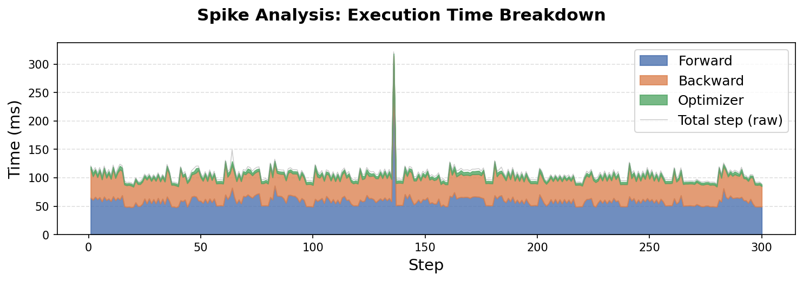

**GC on + annotated** — overlaying gen-2 GC events confirms the spike aligns precisely with a gen-2 collection:

**GC off** — disabling automatic GC produces a perfectly flat trace, confirming GC as the sole cause:

The gen-2 collections are triggered by PyTorch Geometric's `DataLoader`, which creates many short-lived Python objects (graph tensors, batch index tensors) every step. These accumulate through Python's generational GC until a gen-2 sweep fires, pausing the process for **130–180 ms**.

### Case 2: Batch-Shape Dips at Batch Size 4096

The periodic pattern at bs4096 has a completely different cause. The time breakdown shows all three substeps (forward, backward, optimizer) scale down together at the short steps:

Overlaying batch-shape metadata reveals why — the short steps are simply **partial batches** at epoch boundaries:

The training dataset has 10 000 graphs. At batch size 4096, each epoch yields 2 full batches (4096 graphs, ~57 000 nodes, ~118 000 edges) and 1 partial batch (1808 graphs, ~25 000 nodes, ~52 000 edges). Since GNN computation scales with the number of nodes and edges, the partial batch takes proportionally less time. This is expected behavior, not a performance anomaly.

---

## 5. Manual GC Baseline

With GC identified as the spike source, we establish a **clean baseline** by disabling automatic GC during training and forcing a full gen-2 sweep between epochs. This keeps GC pauses outside any measurement window.

| 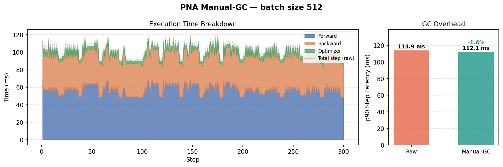 |
|:---:|
| **Batch size 512** — breakdown (left) + p90 overhead comparison to raw (right) |

| 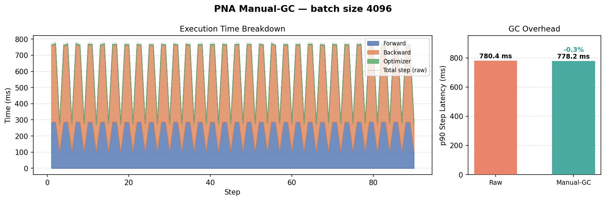 |
|:---:|
| **Batch size 4096** — breakdown (left) + p90 overhead comparison to raw (right) |

### Latency: Step vs Epoch

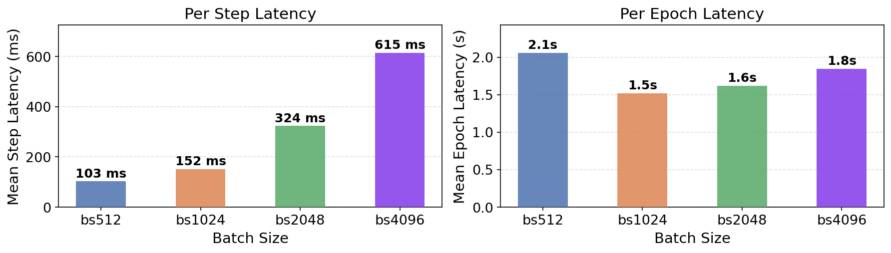

Per-step latency grows linearly with batch size (105 → 615 ms), but per-epoch latency follows a different curve: **bs1024 is fastest** (1.5 s) because it balances step count against per-step compute. Bs512 is slowest (2.1 s) due to having the most steps per epoch.

### Time Breakdown Across Batch Sizes

<table>
<tr>
<td width="280">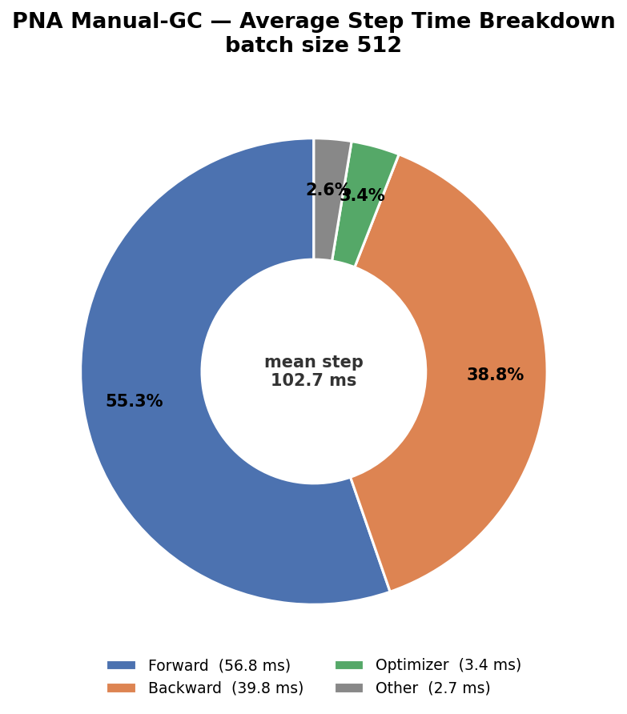</td>
<td width="280">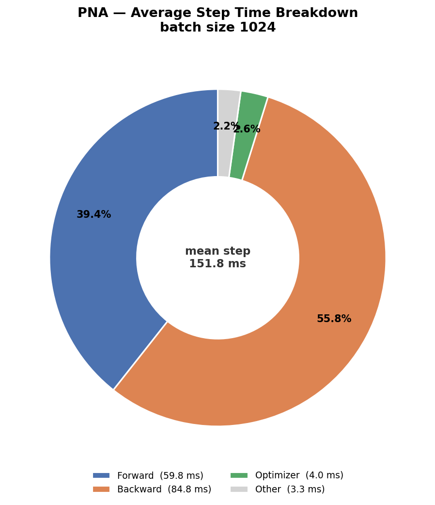</td>
<td width="280"></td>
</tr>
<tr>
<td align="center"><b>bs512</b> — forward 55%, backward 39%</td>
<td align="center"><b>bs1024</b> — forward 39%, backward 56%</td>
<td align="center"><b>bs4096</b> — forward 37%, backward 61%</td>
</tr>
</table>

The dominant substep **shifts from forward to backward** as batch size grows. At small batch sizes, the forward pass is bottlenecked by fixed per-layer overhead (kernel launch latency, index setup across 64 layers) that doesn't scale with graph count. At large batch sizes this overhead becomes negligible; the backward pass dominates because it has a higher per-element constant factor — storing intermediate activations at every layer and accumulating gradients across all nodes.

---

## 6. Hardware Utilization

### Batch Size 4096: Per-Step Detail

| | |
|:---:|:---:|
|  |  |
| *GPU utilization — avg 92.3%* | *CPU utilization (per-process)* |

GPU utilization averages **92.3%** at bs4096 — remarkably high for a GNN workload. The periodic dips in GPU util correspond to the partial batches at epoch boundaries, where the GPU finishes the smaller batch quickly and briefly idles. RAM usage is stable at ~21 GB throughout.

### Utilization Across Batch Sizes and Workers

| | |
|:---:|:---:|
|  |  |
| *GPU utilization scales monotonically: 45% → 56% → 63% → 92%* | *CPU utilization stays high (81–91%) across all sizes* |

GPU utilization **increases monotonically** with batch size because larger batches produce larger CUDA kernels with higher arithmetic intensity per launch. With 2 DataLoader workers pipelining data preparation with GPU compute, the GPU rarely stalls waiting for data.

---

## 7. Energy and Carbon

### Batch Size 4096: Per-Step Detail

| | |
|:---:|:---:|
|  | 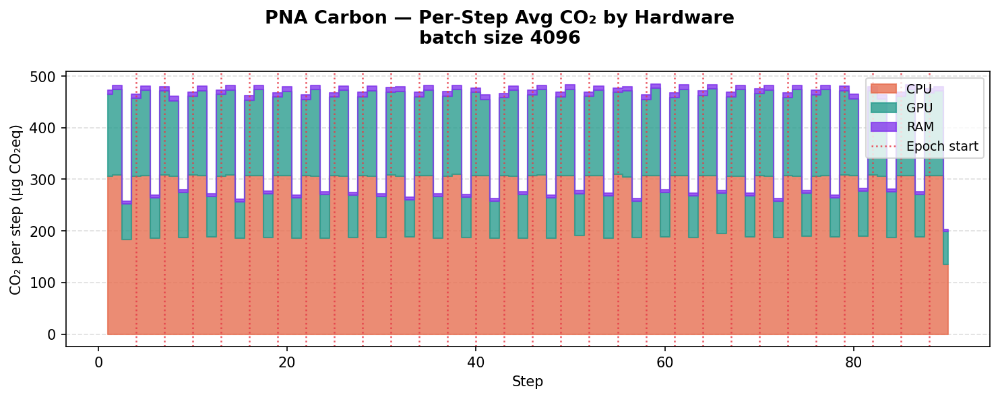 |
| *Per-step energy by hardware (CPU/GPU/RAM)* | *Per-step CO₂ by hardware* |

<table>
<tr>
<td width="340"></td>
<td valign="top">

At bs4096, the **CPU dominates energy consumption** at **65.6%** (0.068 mWh per step), with the GPU at **32.6%** (0.034 mWh) and RAM negligible at **1.8%**.

Despite the GPU running at 92.3% utilization, CPU energy dominates because CodeCarbon attributes CPU power at the constant TDP rate — the full rated thermal design power is charged for every second of wall-clock time.

The carbon emissions breakdown mirrors the energy breakdown exactly (Quebec's grid carbon intensity is a constant factor).

</td>
</tr>
</table>

### Energy Across Batch Sizes

| | |
|:---:|:---:|
|  |  |
| *Avg energy per epoch — bs1024 is the sweet spot* | *Per-step energy by hardware component* |

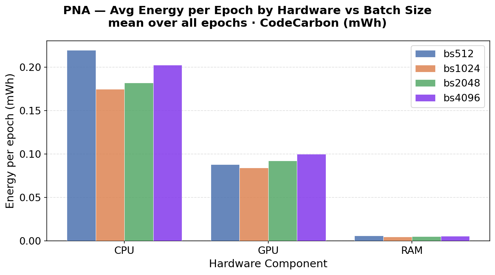

**Bs1024 is the most energy-efficient** configuration (0.264 mWh/epoch). At bs4096, although GPU utilization is highest, the longer per-step computation outweighs the step-count reduction, pushing total energy back up to 0.310 mWh. The result is a U-shaped energy curve — the sweet spot for energy-efficient training is not at the largest batch size.

---

## 8. Varying DataLoader Workers

All previous results use 2 DataLoader workers. To isolate the effect of data-loading parallelism, we sweep workers at **0, 2, and 4** with batch size fixed at 4096.

### GPU and CPU Utilization

| | |
|:---:|:---:|
| 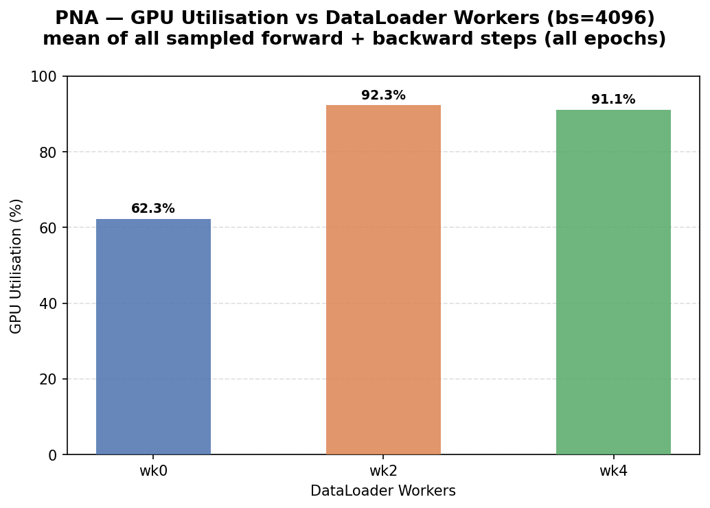 | 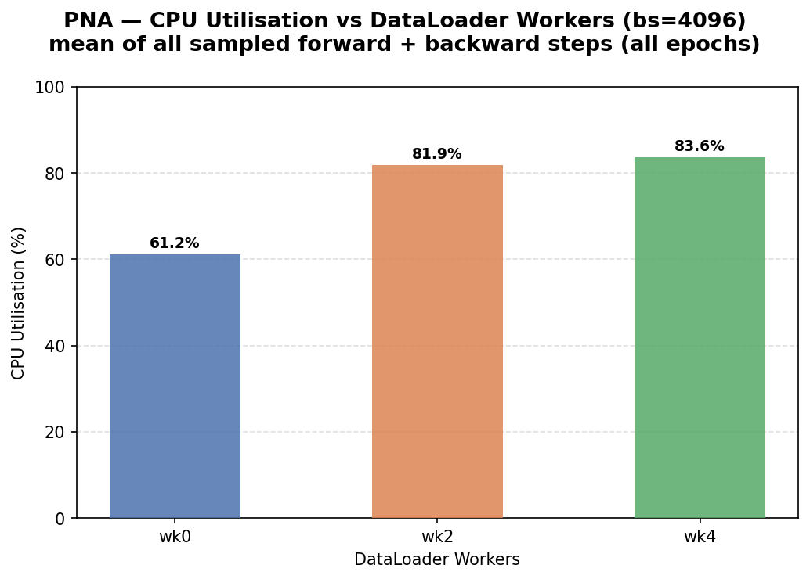 |
| *GPU utilization vs DataLoader workers* | *CPU utilization vs DataLoader workers* |

With **0 workers** (single-threaded data loading), GPU utilization drops significantly because the main thread must alternate between CPU-bound graph collation and GPU kernel dispatch — the GPU idles while waiting for each batch to be prepared. Adding **2 workers** provides a large jump in GPU utilization by pipelining data preparation with GPU compute. Going to **4 workers** provides diminishing returns, as the data loading is no longer the bottleneck at this batch size.

### Energy

| | |
|:---:|:---:|
| 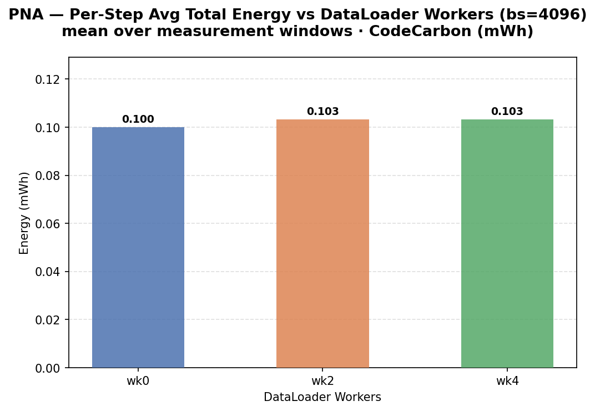 | 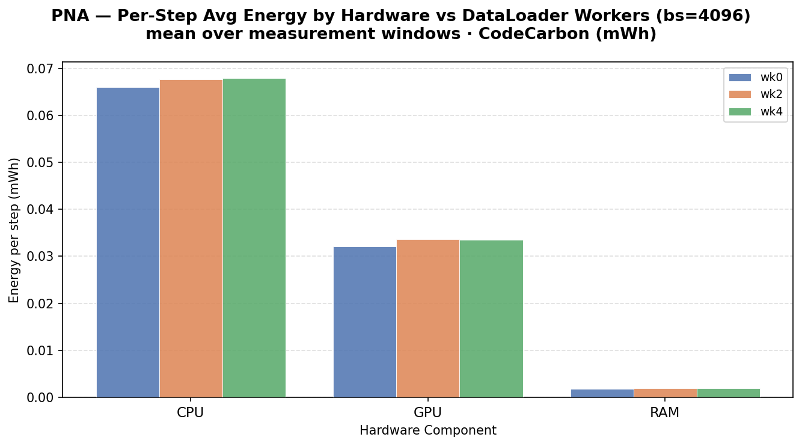 |
| *Avg energy per epoch vs workers* | *Per-step energy by hardware vs workers* |

More workers reduce wall-clock time per epoch, which directly reduces CPU energy (charged at constant TDP rate). The energy savings from 0 → 2 workers are substantial; from 2 → 4 workers the improvement flattens, consistent with the GPU utilization plateau.

---

## 9. Summary

1. **Raw measurement reveals two distinct anomalies**: GC spikes at smaller batch sizes and batch-shape dips at bs4096. Spike analysis confirms the first is caused by Python gen-2 garbage collection; the second is simply partial batches at epoch boundaries.

2. **Manual GC baseline** eliminates GC noise, enabling clean measurement of utilization and energy. The overhead of GC on tail latency is modest (~1–2% at p90) but the spikes are visually dramatic.

3. **Step time is dominated by forward at small batch sizes and backward at large batch sizes**, due to fixed per-layer overhead being amortized at larger scales while backward's per-element gradient cost grows.

4. **GPU utilization scales monotonically** with batch size (44.6% → 92.3%) thanks to DataLoader worker pipelining. Without workers, utilization shows a non-monotonic dip at intermediate sizes.

5. **Bs1024 is the energy sweet spot** (0.264 mWh/epoch, 1.5 s/epoch) — not bs4096, despite its higher GPU utilization. Larger batches increase per-step energy faster than they reduce step count.

6. **CPU energy dominates** (~66%) at all batch sizes due to CodeCarbon's constant-TDP attribution model. Reducing wall-clock time is the primary lever for cutting emissions.
