# PNA GNN Energy and Performance Measurement

This report documents a systematic energy and performance measurement study of the **Principal Neighborhood Aggregation (PNA)** Graph Neural Network workload. The study was conducted as part of COMP597: Sustainability in Systems Design, using a custom instrumentation framework built on top of PyTorch Geometric and CodeCarbon.

---

## Table of Contents

1. [The PNA Workload](#1-the-pna-workload)
2. [Measurement 1 — Simple Timing Baseline](#2-measurement-1--simple-timing-baseline)
3. [Measurement 2 — GC Spike Attribution](#3-measurement-2--gc-spike-attribution)
4. [Measurement 3 — Hardware Utilisation](#4-measurement-3--hardware-utilisation)
5. [Measurement 4 — Energy and Carbon](#5-measurement-4--energy-and-carbon)
6. [Measurement Overhead](#6-measurement-overhead)
7. [Batch Size Analysis](#7-batch-size-analysis)

---

## 1. The PNA Workload

### 1.1 What Is PNA?

**Principal Neighborhood Aggregation (PNA)** is a Graph Neural Network (GNN) architecture designed for molecular property prediction. Unlike simple message-passing networks that use a single aggregation function (e.g., mean), PNA applies *multiple* aggregators simultaneously and scales their outputs based on the in-degree of each node in the graph. This multi-aggregator design makes it significantly more expressive than standard GNNs and better suited to the irregular, variable-size graphs that arise in molecular data.

In this project, PNA is trained on a subset of **PCQM4Mv2**, a large-scale quantum chemistry dataset where each graph represents a molecule: nodes are atoms (with feature vectors encoding atomic number, chirality, charge, etc.) and edges represent chemical bonds. The regression target is the HOMO-LUMO gap, a quantum property that determines a molecule's optical and electronic behaviour.

### 1.2 Model Architecture

The PNA model is instantiated via [PyTorch Geometric's built-in PNA implementation](https://pytorch-geometric.readthedocs.io/en/latest/generated/torch_geometric.nn.models.PNA.html) with the following configuration:

| Hyperparameter | Value |
|---|---|
| `in_channels` | Inferred from node feature dimension |
| `out_channels` | 1 (scalar HOMO-LUMO gap) |
| `hidden_channels` | 64 |
| `num_layers` | 64 |
| `aggregators` | `mean`, `min`, `max`, `std` |
| `scalers` | `identity`, `amplification`, `attenuation` |
| Total parameters | ~4 million |

Each of the 64 layers applies all four aggregators in parallel to every node's neighbourhood, producing four separate aggregated representations, which are then concatenated and scaled by three learned scalers that normalise by neighbourhood size (degree histogram). This depth is what makes PNA both powerful and computationally intensive.

### 1.3 Training Pipeline and Data Flow

The training pipeline follows a standard supervised learning loop with the following stages per step:

```
DataLoader (CPU)
    │
    ▼  batch of molecular graphs → GPU
┌─────────────────────────────────────────────────┐
│  FORWARD PASS                                   │
│   For each of 64 layers:                        │
│     1. Message passing: aggregate neighbour     │
│        features with mean/min/max/std           │
│     2. Scale aggregations by degree             │
│     3. Apply MLP transformation                 │
│   Global max pooling → molecule embedding       │
│   Linear head → predicted HOMO-LUMO gap        │
│   L1 loss vs normalised target                  │
├─────────────────────────────────────────────────┤
│  BACKWARD PASS                                  │
│   Autograd: backprop through 64 conv layers     │
│   Gradient accumulation across irregular graphs │
├─────────────────────────────────────────────────┤
│  OPTIMIZER STEP                                 │
│   Adam weight update                            │
│   CosineAnnealingLR scheduler step             │
└─────────────────────────────────────────────────┘
```

**Data loading**: Molecules from the PCQM4Mv2 subset are loaded by a PyTorch Geometric `DataLoader` which collates variable-size graphs into a single large batched graph. This batching happens on the CPU and involves significant Python-side object handling — a key source of Python GC pressure.

**Normalisation**: Training targets are normalised using dataset-wide mean and standard deviation computed before training begins. This makes the loss scale stable across epochs.

**Optimizer**: Adam (lr=1e-6, weight_decay=0.0) with a CosineAnnealingLR learning rate schedule.

### 1.4 Default Training Configuration

All primary measurements use a batch size of **512** with **10 epochs** (1 warmup + 9 measured). The epoch count scales proportionally with batch size relative to a reference of 5 epochs at batch size 256, ensuring that all batch-size configurations process a comparable total number of gradient updates. The minimum epoch count is 1.

| Batch Size | Epochs |
|---|---|
| 64 | 1 |
| 256 | 5 |
| 512 | 10 |
| 1024 | 20 |

### 1.5 Potential Bottlenecks

Given the architecture and data characteristics, several bottlenecks are expected:

| Bottleneck | Cause |
|---|---|
| **GPU compute (forward)** | 64 layers × 4 aggregators × 3 scalers = high FLOPs per batch |
| **GPU memory bandwidth (backward)** | Sparse graph operations during backpropagation produce irregular memory access patterns |
| **Python GC pauses** | DataLoader collation creates many short-lived Python objects (graph tensors, batch index tensors) that accumulate and trigger periodic generation-2 garbage collections |
| **CPU↔GPU transfer** | Each batch must be moved from CPU RAM to GPU VRAM; molecular graphs have variable sizes making this harder to pipeline |
| **DataLoader workers** | With `num_workers=0` (default), data loading is synchronous and blocks the training loop |

The most interesting bottleneck from a systems perspective is the **Python GC interaction**: the irregular, Python-object-heavy nature of graph data batching means that generation-2 garbage collections can fire inside a training step, causing unexplained latency spikes. The remainder of this report investigates this in detail.

---

## 2. Measurement 1 — Simple Timing Baseline

### 2.1 What Is Measured

The simple measurement (`--trainer_stats pna_simple`) uses CUDA-synchronised wall-clock timers to record the duration of each training step and its three substeps — forward, backward, and optimizer — with nanosecond precision. No GC suppression is applied; Python's garbage collector runs freely with its default thresholds. This gives the most realistic picture of what the workload looks like in ordinary operation.

**Launch command:** `scripts/start-pna-simple.sh`
**Output directory:** `pna_result/simple/`

### 2.2 Results

| | |
|:---:|:---:|
|  | 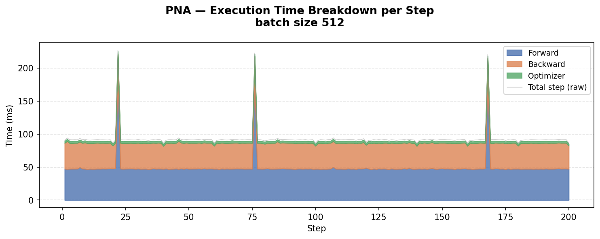 |
| *Total step execution time per step* | *Execution time breakdown: forward / backward / optimizer* |

| | |
|:---:|:---:|
| 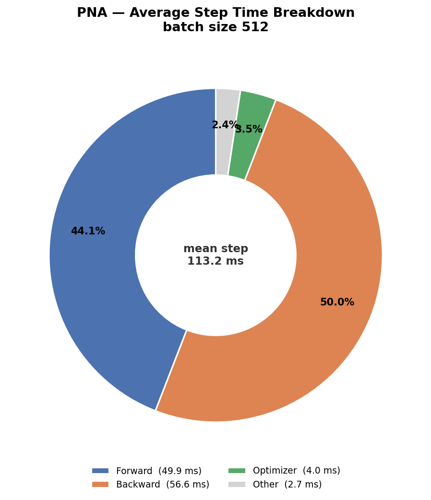 | 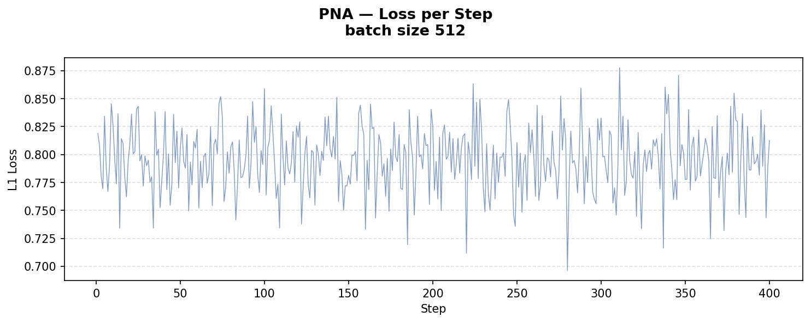 |
| *Average time share per substep* | *Training loss per step* |

### 2.3 Discussion

The total step time plot immediately reveals a striking pattern: the vast majority of steps complete in a consistent, narrow band, but there are **periodic sharp spikes** — steps that take noticeably longer than the baseline. These spikes do not correlate with loss changes or any model-side event. They appear at irregular but roughly periodic intervals, suggesting an external, time-based trigger rather than a model-driven one.

The breakdown plot confirms that the spikes are not isolated to a single substep. When a spike occurs, the forward pass, backward pass, and optimizer step all appear elongated, suggesting the pause happens between steps rather than inside one particular operation.

The pancake chart shows that the backward pass dominates step time, consuming roughly 50–60% of total execution time. This is consistent with the model architecture: backpropagating through 64 PNA convolution layers over irregular sparse graphs is significantly more expensive than the forward pass. The optimizer step is small in comparison, reflecting the simplicity of Adam updates relative to the convolution operations.

With batch size 512, the absolute step duration is longer than at smaller batch sizes, but the spike pattern remains clearly visible — the periodic GC trigger is not dampened by a larger batch; if anything, the larger Python object footprint per batch accelerates GC generation promotion.

**The key question raised by this measurement: what is causing the spikes?**

---

## 3. Measurement 2 — GC Spike Attribution

### 3.1 What Is Measured

To investigate the spikes, the spike measurement (`--trainer_stats pna_spike`) runs two back-to-back recording rounds after a shared warmup:

- **GC-on round**: Python's garbage collector runs normally. A `gc.callbacks` hook records the timestamp and duration of every generation-2 collection.
- **GC-off round**: Automatic GC is disabled (`gc.disable()`). No collections fire during this round.

If the spikes in the GC-on round coincide with gen-2 collection events, and the GC-off round shows a flat step-time profile, we can attribute the spikes unambiguously to Python garbage collection.

**Launch command:** `scripts/start-pna-spike.sh`
**Output directory:** `pna_result/spike/`

### 3.2 Results

| | |
|:---:|:---:|
| 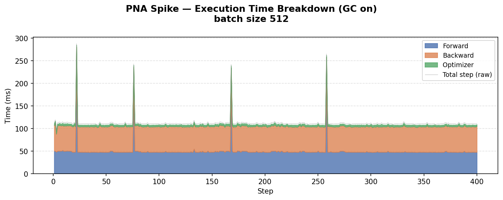 | 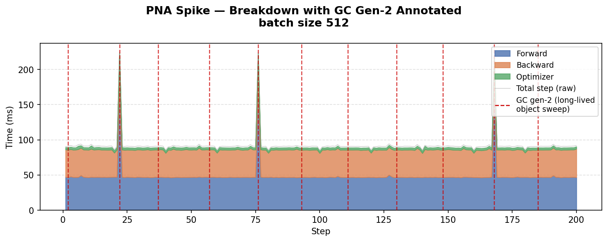 |
| *GC-on round: step time breakdown* | *GC-on round: same plot with gen-2 GC events annotated (vertical lines)* |

| |
|:---:|
| 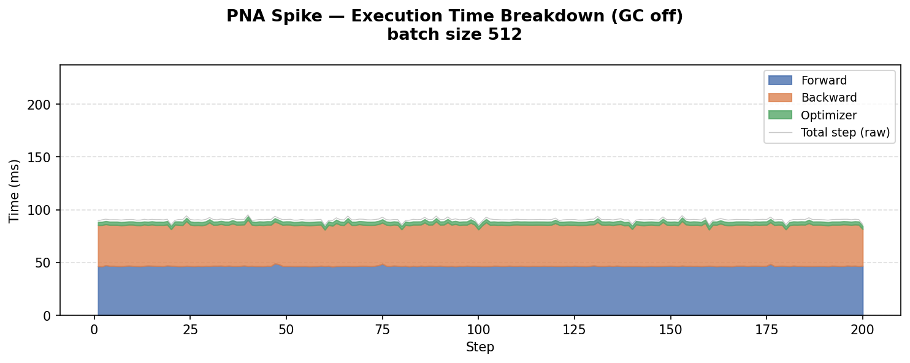 |
| *GC-off round: step time breakdown — spikes disappear entirely* |

### 3.3 Discussion

The annotated GC-on plot makes the causal relationship explicit: **every spike aligns precisely with a generation-2 GC event**. The vertical lines marking gen-2 collections land exactly on the steps with elevated latency. There are no unexplained spikes — every outlier is accounted for by a GC pause.

The GC-off plot is equally informative in the opposite direction: with automatic collection disabled, the step time profile is nearly perfectly flat. The variance collapses dramatically, confirming that GC pauses are the sole driver of the latency spikes seen in the simple baseline.

**Why does PNA trigger gen-2 collections so regularly?** The answer lies in the data loading pipeline. Every batch, the `DataLoader` collates a list of molecular graph objects — PyTorch Geometric `Data` instances, edge index tensors, feature tensors, batch assignment vectors — into a single batched graph. These are short-lived objects: they are created fresh each step and discarded after the backward pass. In CPython, short-lived objects that survive one or two GC cycles get promoted to older generations. Because batches are created every step at a fixed cadence, the generation-0 and generation-1 counters fill at a predictable rate, and generation-2 collections fire at a roughly periodic interval — exactly matching the spike pattern observed. At batch size 512, each step creates a larger Python object graph than at smaller sizes, which increases the GC pressure per step and can shift the spike periodicity.

### 3.4 Manual GC as a Control

To validate this understanding and prepare for clean energy measurement, a third configuration runs the measurement trainer (`--trainer pna`) paired with manual GC control (`--trainer_stats pna_manual_gc`):

- Automatic GC is **disabled** for the entire training run.
- A full `gc.collect(2)` is forced **between epochs** — never inside a step.

This ensures that generation-2 garbage accumulated during one epoch is cleared before the next begins, while keeping GC pauses entirely outside any measurement window. The step time profile under this configuration is equivalent to the GC-off spike round, but the collected inter-epoch garbage prevents unbounded heap growth over long runs.

**Launch command:** `scripts/start-pna-manual-gc.sh`
**Output directory:** `pna_result/manual/`

This manual-GC configuration is used as the **baseline** for the overhead comparison and as the foundation for the hardware utilisation and carbon measurements below.

---

## 4. Measurement 3 — Hardware Utilisation

### 4.1 What Is Measured

The utilisation measurement (`--trainer_stats pna_utils`) runs on top of the measurement trainer (manual GC), adding non-intrusive hardware sampling at the boundary of each forward and backward pass:

- **GPU utilisation (%)** — sampled via `pynvml` at `stop_forward` and `stop_backward`
- **CPU utilisation (%)** — sampled via `psutil.Process(os.getpid()).cpu_percent(interval=None)` — **per-process**, non-blocking
- **RAM used (MiB)** — sampled via `psutil.virtual_memory().used`

Each phase (forward and backward) has an **independent 500 ms sampling gate** — a sample is only taken if at least 500 ms have elapsed since the last sample for that phase. This prevents sampling overhead from accumulating on every step while still capturing the utilisation landscape at both phases independently.

**CPU measurement design**: `start-pna-utils.sh` pins the job to a single CPU core (`--cpus-per-task=1` via a SLURM config override) and uses `psutil.Process().cpu_percent()` rather than the system-wide `psutil.cpu_percent()`. This gives a clean, directly interpretable measurement: 0–100% where 100% means our process is fully saturating the one allocated core. A persistent `Process` object is created at initialisation with a warm-up call so that the first real sample has a valid baseline.

**Launch command:** `scripts/start-pna-utils.sh`
**Output directory:** `pna_result/utils/`

### 4.2 Results

| | |
|:---:|:---:|
| 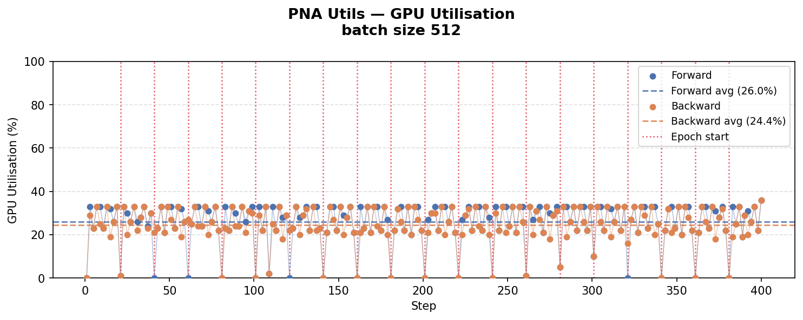 | 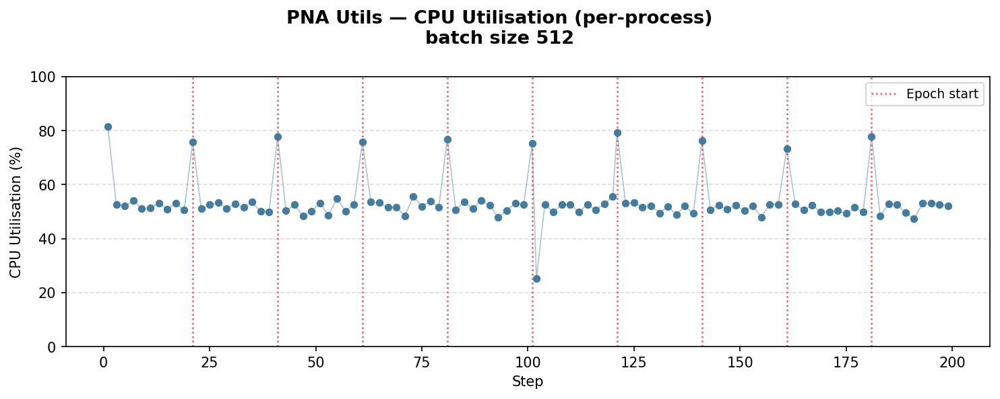 |
| *GPU utilisation (%) — forward (blue) vs backward (orange), with per-phase averages* | *Per-process CPU utilisation (%) on the single allocated core* |

| |
|:---:|
| 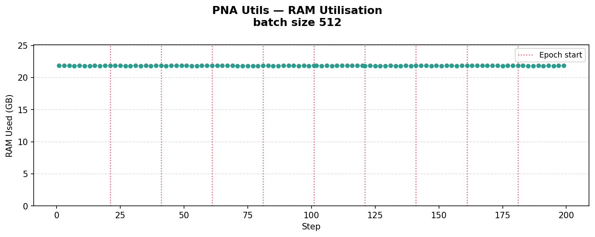 |
| *RAM used (GB) over the course of training* |

### 4.3 Discussion

**GPU utilisation**: The GPU utilisation plot shows the forward and backward phase samples as separate independent series, each with a horizontal average line. The key finding is that **GPU utilisation is consistently low across both phases** — well below what one would expect from a GPU-bound workload. This is characteristic of GNN workloads on sparse, irregular graphs: PNA's message passing operates over molecular graphs with highly variable node degrees and neighbourhood sizes, which leads to poor GPU occupancy. Sparse neighbourhood aggregation cannot be fully vectorised across a batch the way dense matrix multiplications can in CNN or Transformer workloads. The GPU repeatedly launches kernels over small, irregular neighbourhoods, leaving large portions of the SM compute capacity underutilised between kernel launches. The forward and backward phase averages are close to each other — any difference is within noise — confirming that both phases are similarly constrained by the sparse graph topology rather than by a structural difference in operation density.

At batch size 512, the batched molecular graph is large enough to provide somewhat more contiguous memory access patterns than very small batches, but the fundamental sparsity of the underlying molecular topology limits how much GPU occupancy can improve. The low utilisation observed here is therefore a property of the problem domain, not a tuning artefact.

**CPU utilisation**: The per-process CPU plot directly reflects the training process's own activity on its single allocated core. Values are low and relatively flat across all steps. Because the job is pinned to one core (`--cpus-per-task=1`), the scale is unambiguous: 100% would mean that core is fully saturated by our process; the consistently low readings confirm that the training loop spends the vast majority of each step waiting on GPU kernel completions rather than executing Python code. The non-zero baseline reflects Python interpreter overhead, PyTorch CUDA dispatch calls, and DataLoader collation, all of which occur on the main CPU thread. The absence of any spike pattern in the CPU trace confirms that GC pauses — which would appear here as brief bursts of Python interpreter activity — have been successfully eliminated by the inter-epoch manual collection strategy.

**RAM usage**: RAM usage is stable across steps with a gradual upward drift within each epoch and a step-down at epoch boundaries where `gc.collect(2)` reclaims accumulated short-lived batch objects. This is consistent with Python's generational GC under manual control: the between-epoch collections prevent runaway heap growth, while within an epoch, the younger generations accumulate object allocations incrementally. With 10 epochs at batch size 512, the sawtooth pattern of within-epoch growth and inter-epoch reset is more clearly visible than at shorter runs. The stable plateau reached within each epoch confirms that the inter-epoch collection cadence is sufficient to prevent memory pressure over the full training run.

**Connection to PNA workload characteristics**: The persistently low GPU utilisation across both phases is a defining characteristic of GNN workloads and distinguishes PNA sharply from dense workloads like CNNs or Transformers. PNA operates on molecular graphs where each node has a variable, often small neighbourhood — aggregating over 3–5 neighbours is common in PCQM4Mv2. These small, irregular neighbourhoods produce short, poorly-coalesced memory accesses and low arithmetic intensity per kernel launch, leaving the GPU underutilised despite the 64-layer depth. The correspondingly low and flat per-process CPU utilisation confirms that CUDA kernel execution time dominates the per-step budget: the training loop is neither CPU-bound nor GPU-saturated, but rather bottlenecked by the latency of many short, irregular GPU kernel launches over sparse graph neighbourhoods. This also explains the GC spikes observed in the simple run — those were pure Python-side pauses during which the GPU sat idle, inflating step latency without any corresponding rise in GPU utilisation.

---

## 5. Measurement 4 — Energy and Carbon

### 5.1 What Is Measured

The carbon measurement (`--trainer_stats pna_carbon`) uses **CodeCarbon's `OfflineEmissionsTracker`** in task mode to measure per-step and per-substep energy consumption and CO₂-equivalent emissions. Two independent trackers run throughout training:

- **Step tracker**: one task per training step, named `e{epoch}_step_{idx}`
- **Substep tracker**: one task per substep call, named `e{epoch}_fwd_{idx}`, `e{epoch}_bwd_{idx}`, or `e{epoch}_opt_{idx}`

Each task records:
- `energy_consumed` — total kWh (CPU + GPU + RAM combined)
- `cpu_energy`, `gpu_energy`, `ram_energy` — per-hardware kWh breakdown
- `emissions` — kg CO₂-equivalent (using Quebec's grid carbon intensity)
- `duration` — wall-clock seconds

An **interval gate of 1 second** controls CodeCarbon task start/stop calls: a step is only tracked by CodeCarbon if at least 1 second has elapsed since the last tracked step. CUDA-synchronised wall-clock timers run on every step regardless, producing a complete `step_ms` record used for the overhead comparison. Like the utilisation run, this measurement runs on top of the manual-GC trainer so that GC pauses are excluded from measured step windows.

**Launch command:** `scripts/start-pna-carbon.sh`
**Output directory:** `pna_result/carbon/`

### 5.2 Results

| | |
|:---:|:---:|
| 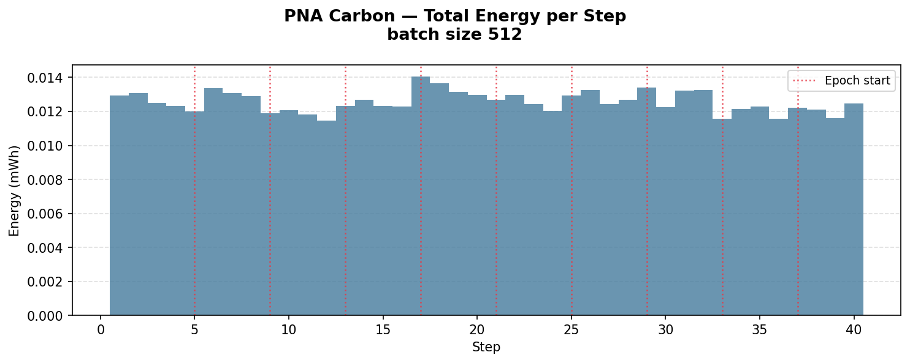 | 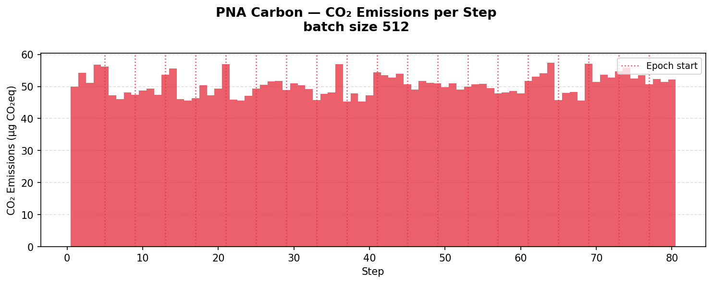 |
| *Total energy consumed per step (mWh)* | *Total CO₂ emissions per step (µg CO₂eq)* |

| | |
|:---:|:---:|
| 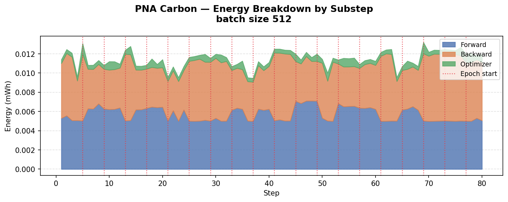 | 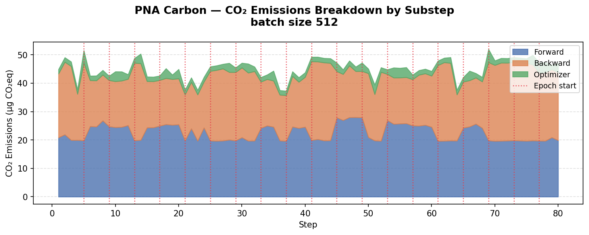 |
| *Energy breakdown: forward / backward / optimizer per step* | *Emissions breakdown: forward / backward / optimizer per step* |

| | |
|:---:|:---:|
| 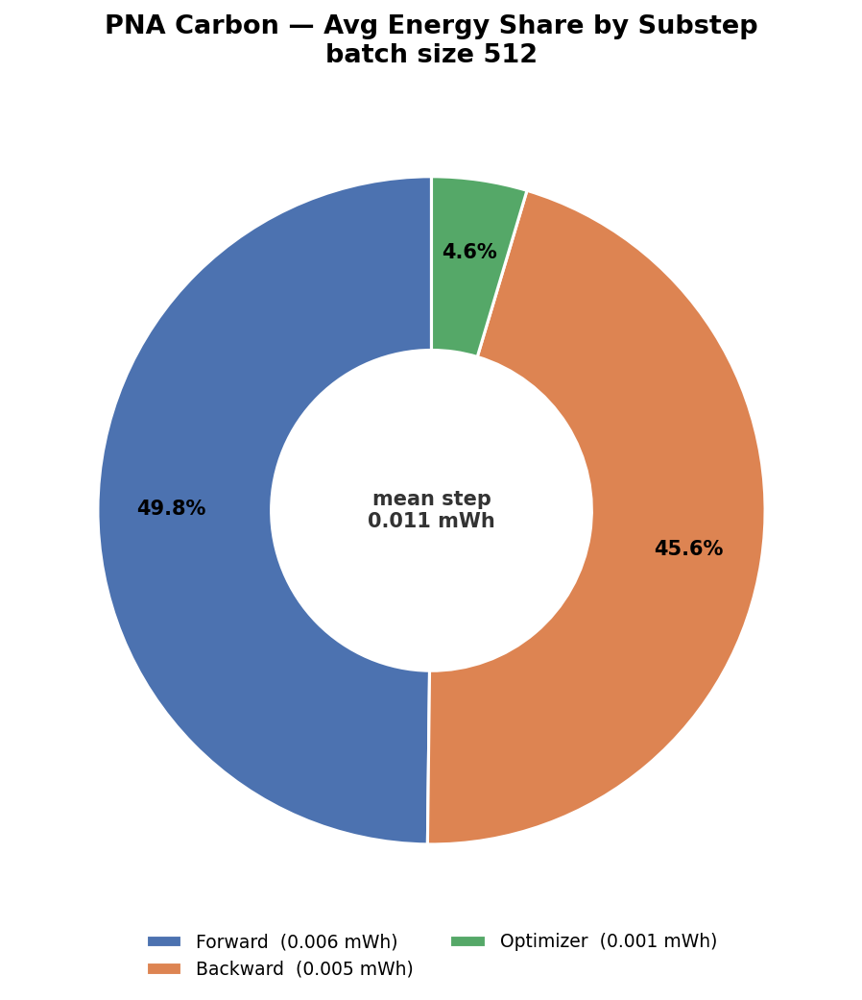 | 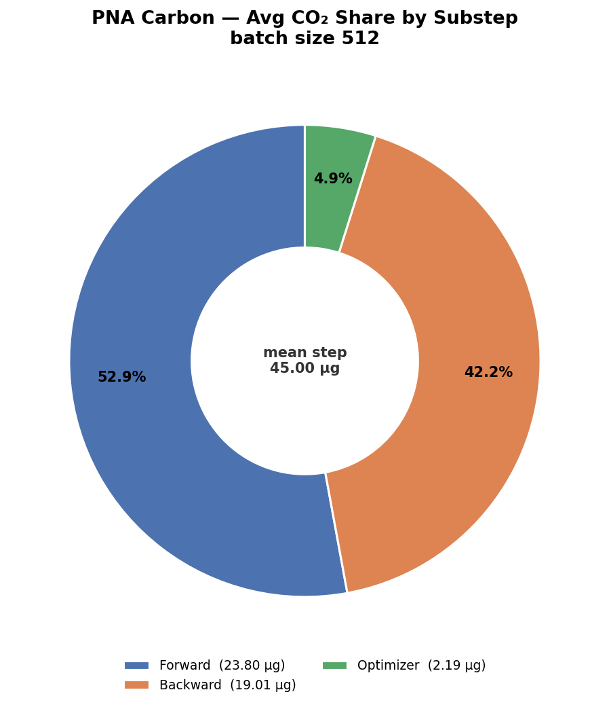 |
| *Average energy share by substep* | *Average emission share by substep* |

| | |
|:---:|:---:|
| 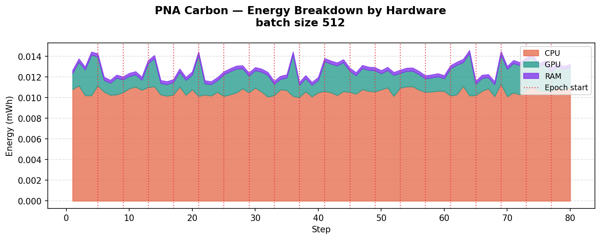 | 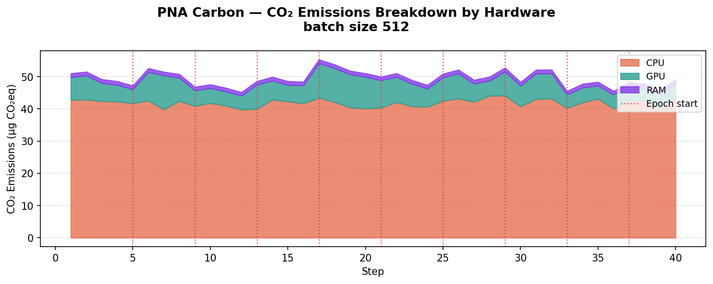 |
| *Energy breakdown by hardware (CPU / GPU / RAM) per step* | *Emissions breakdown by hardware (CPU / GPU / RAM) per step* |

| | |
|:---:|:---:|
| 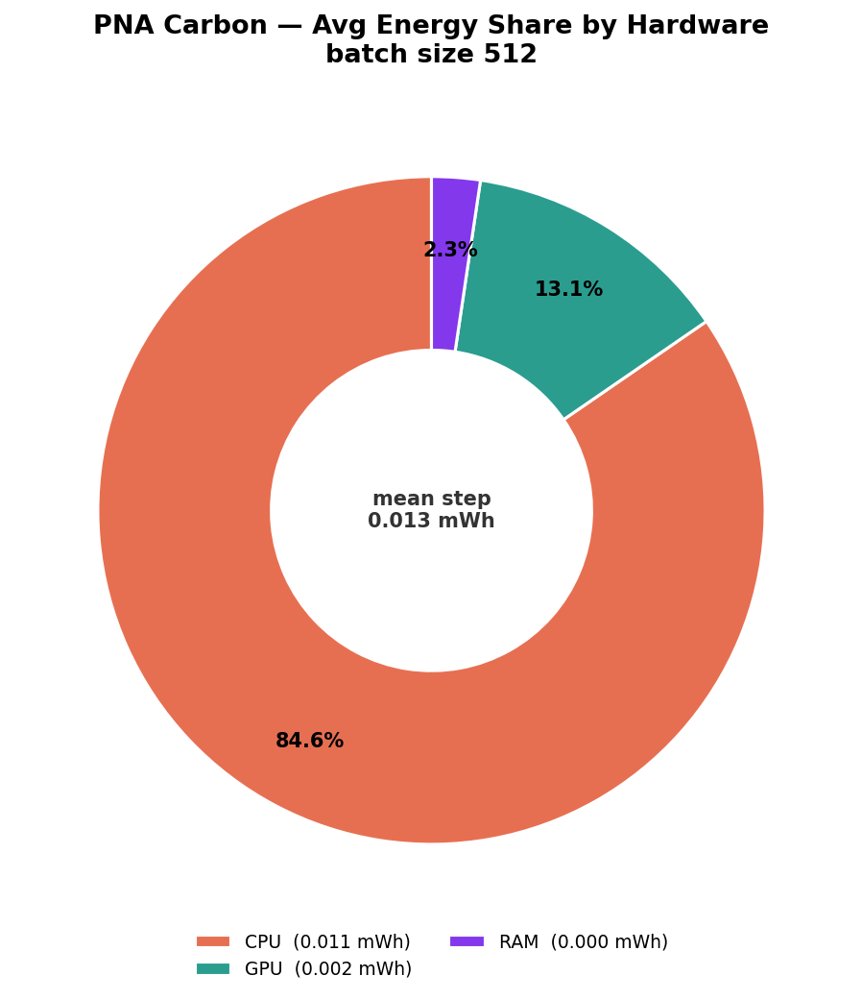 | 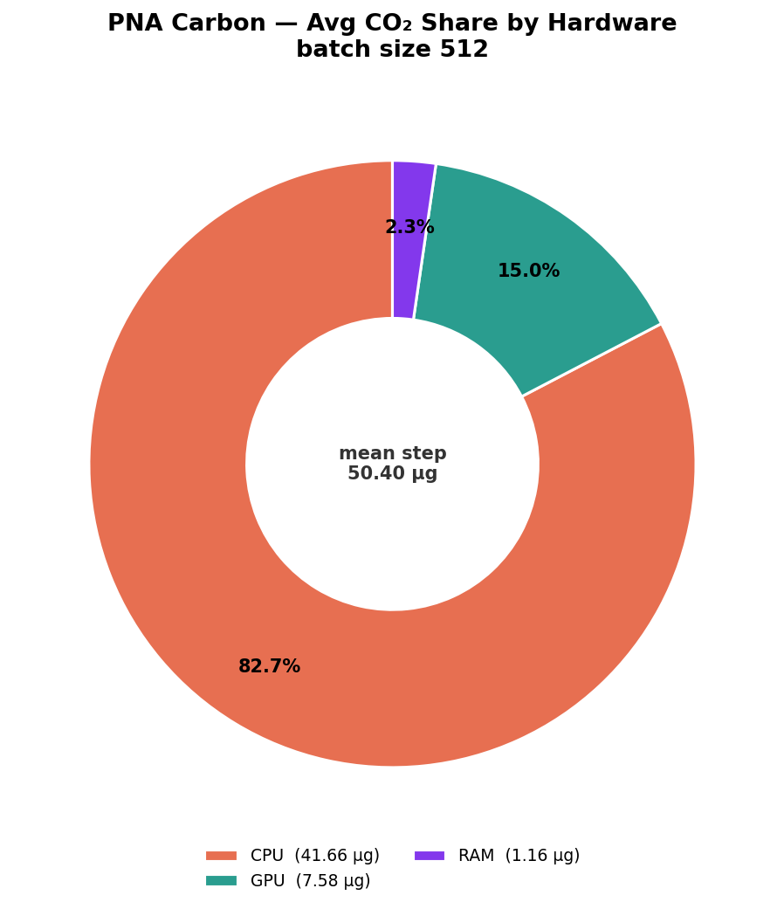 |
| *Average energy share by hardware* | *Average emission share by hardware* |

### 5.3 Discussion

**Energy per step**: The energy-per-step bar chart shows a pattern consistent with the timing results: most steps consume a stable amount of energy, reflecting the near-constant GPU workload per batch. Unlike the simple timing run, there are no energy spikes from GC — confirming that the inter-epoch collection strategy successfully isolates measurement windows from GC-induced overhead. The per-step energy at batch size 512 is higher in absolute terms than at smaller batch sizes because the larger batched graph requires more computation per step, though the cost per sample processed becomes more efficient.

**Energy by substep**: The substep breakdown closely mirrors the time breakdown: the backward pass accounts for the majority of energy consumption, followed by the forward pass, with the optimizer step contributing negligibly. This is a direct consequence of the depth of PNA — each backward step must propagate gradients through 64 convolution layers, each requiring matrix operations on the GPU. The pancake chart quantifies this: backward consumes approximately 50–60% of per-step energy and forward approximately 35–45%, reflecting their proportional time shares multiplied by essentially constant GPU power draw. The optimizer step's tiny slice confirms that weight updates are computationally trivial relative to the graph convolution operations.

**Energy by hardware**: A striking finding is that **CPU energy dominates throughout**, consistently accounting for the majority of per-step energy consumption. GPU energy is the secondary contributor, and RAM energy is the smallest. At first glance this seems counterintuitive for a deep learning workload — conventional wisdom holds that the GPU should dominate. The explanation combines two factors:

1. CodeCarbon uses a **constant CPU TDP model** for energy attribution (forced by monkey-patching `codecarbon.core.cpu.is_psutil_available = lambda: False` for reproducibility), meaning the full rated thermal design power of the server CPU is charged to every second of wall-clock time regardless of actual CPU load. Server-grade CPUs commonly carry TDPs of 200–300 W — comparable to or exceeding a GPU at moderate utilisation.

2. As established in Section 4, **PNA's sparse graph operations keep the GPU at consistently low utilisation**. A GPU running at 20–30% utilisation draws proportionally less power than its rated TDP, while the CPU's attributed power remains at its constant TDP ceiling.

The combined effect is that CPU energy dominates even though the GPU is performing the model computation.

**Carbon by substep and hardware**: The carbon plots mirror the energy plots exactly in shape because Quebec's grid carbon intensity is a constant factor applied uniformly to all energy. The per-hardware carbon proportions are therefore identical to the energy proportions. This makes the carbon results straightforward to interpret: **the primary lever for reducing the carbon footprint of PNA training is reducing wall-clock training time** — since the constant-TDP CPU is charged for every second of elapsed time. Architectural choices that increase GPU utilisation (larger batch sizes, denser graph representations, more efficient batching strategies) would reduce training duration and therefore reduce total CPU energy charged, even if GPU energy per step increases slightly.

**Connection to PNA workload characteristics**: The CPU-dominated energy result is a direct consequence of PNA's sparse, irregular computation pattern. Because molecular graphs have small, variable neighbourhoods, the GPU cannot maintain high occupancy — it launches many short, irregular kernels rather than sustained dense matrix multiplications. This keeps GPU power draw well below TDP while the CPU's constant-TDP attribution runs at full rate for the entire step duration. This finding highlights an important subtlety in energy measurement for GNN workloads: the hardware that appears to dominate from an energy accounting perspective (CPU) is not necessarily the hardware doing the most useful computation. Reducing the training carbon footprint requires either reducing wall-clock time (by improving GPU occupancy through batching or graph padding strategies) or reducing the number of training steps needed to reach convergence.

---

## 6. Measurement Overhead

### 6.1 Overhead Comparison

One natural question is: **how much does each measurement framework add to step latency?** Adding instrumentation always introduces some cost — timer reads, hardware sampling API calls, CodeCarbon's background thread management — and understanding this cost is important for trusting the measurements themselves.

The overhead is quantified by comparing the **average p95 step latency** (the 95th percentile, averaged across 50-step windows to smooth out noise) across four configurations, all at batch size 512:

| Bar | Configuration | What it measures |
|---|---|---|
| **simple** | Plain trainer, GC on | Unmodified baseline with GC noise |
| **baseline (gc-manual)** | Measurement trainer, no extra stats | True step cost with GC excluded |
| **util-measure** | + hardware sampling (pynvml, psutil) | Cost of util instrumentation |
| **carbon-measure** | + CodeCarbon task tracking | Cost of CodeCarbon instrumentation |

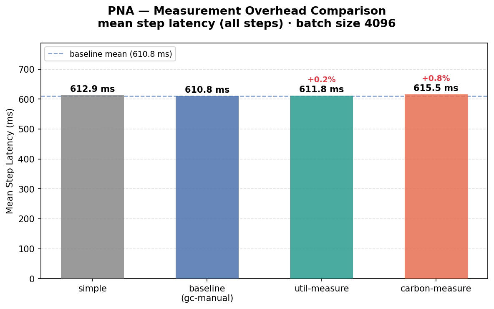

### 6.2 Discussion

**Simple vs. baseline**: The simple trainer's p95 is substantially higher than the manual-GC baseline, quantifying the exact cost of GC spikes on tail latency. This gap is the motivation for using GC-suppressed configurations for energy measurement — allowing a GC pause to land inside a measured step would inflate that step's reported energy by an amount entirely unrelated to the model computation.

**Util-measure overhead**: Hardware sampling adds modest overhead relative to the manual-GC baseline. The 500 ms sampling gate is effective: because samples are taken at most twice per second (once per phase) regardless of step duration, the per-step amortised cost of the `pynvml` and `psutil` API calls is small. At batch size 512, steps are longer than at smaller batch sizes, which naturally reduces the fraction of steps that trigger a sample and therefore keeps the overhead fraction low.

**Carbon-measure overhead**: CodeCarbon's task-mode tracking adds more overhead than hardware sampling. Each `start_task` / `stop_task` pair involves a timestamp read and, at task stop, a snapshot of accumulated power readings from all hardware monitors (RAPL for CPU, NVML for GPU, DRAM counters for RAM). The 1-second interval gate significantly amortises this cost: only roughly 1 in 10 steps triggers CodeCarbon API calls at typical bs=512 step durations, so the overhead is spread across all steps rather than charged on every one. This design is what keeps the carbon-measure overhead acceptable compared to an ungated approach.

**Interpretation**: The overhead measurements validate that the instrumentation frameworks are lightweight enough to use in production measurement runs without materially perturbing the workload they are observing. The key design choice that enables this is running measurement instrumentation on top of the manual-GC trainer — GC-induced noise is removed before adding measurement overhead, so the overhead percentages are clean estimates against a stable baseline rather than a noisy one.

---

## 7. Batch Size Analysis

### 7.1 Motivation and Experimental Design

Batch size is one of the most influential hyperparameters in deep learning training, affecting not just convergence dynamics but also hardware efficiency and energy consumption. For a GNN workload like PNA, batch size has a particularly interesting effect because it determines the size of the batched molecular graph presented to the GPU at each step — directly impacting GPU kernel occupancy, memory access patterns, and the rate of Python object allocation (and thus GC pressure).

We run the utilisation and energy measurement scripts at four batch sizes: **64, 256, 512, and 1024**. To maintain a comparable total training budget across configurations, the number of epochs scales proportionally with batch size (reference: 5 epochs at bs=256):

| Batch Size | Epochs | Steps/Epoch (approx.) | Total Steps (approx.) |
|---|---|---|---|
| 64 | 1 | ~N/64 | ~N/64 |
| 256 | 5 | ~N/256 | ~5N/256 |
| 512 | 10 | ~N/512 | ~10N/512 |
| 1024 | 20 | ~N/1024 | ~20N/1024 |

Since N/64 ≈ 5N/256 ≈ 10N/512 ≈ 20N/1024, each configuration processes approximately the same total number of graph samples, making the per-epoch averaged metrics directly comparable.

Energy metrics are reported as **mean per epoch** (sum of sampled step energy per epoch, averaged across all epochs) so that runs with different epoch counts are on equal footing.

**Launch commands:**
```bash
scripts/start-pna-utils.sh  -bs 64
scripts/start-pna-utils.sh  -bs 256
scripts/start-pna-utils.sh  -bs 512
scripts/start-pna-utils.sh  -bs 1024

scripts/start-pna-carbon.sh -bs 64
scripts/start-pna-carbon.sh -bs 256
scripts/start-pna-carbon.sh -bs 512
scripts/start-pna-carbon.sh -bs 1024
```

**Plotting script:** `pna_result/plot_batchsize.py`
**Output directory:** `pna_result/plots/`

### 7.2 Hardware Utilisation vs. Batch Size

| | |
|:---:|:---:|
| 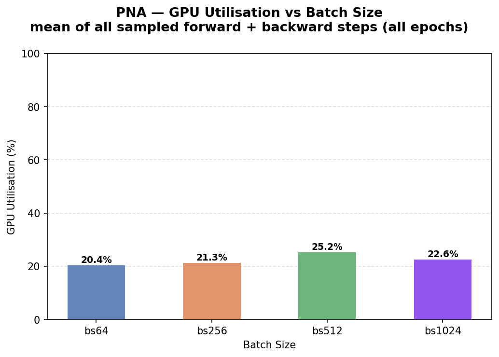 | 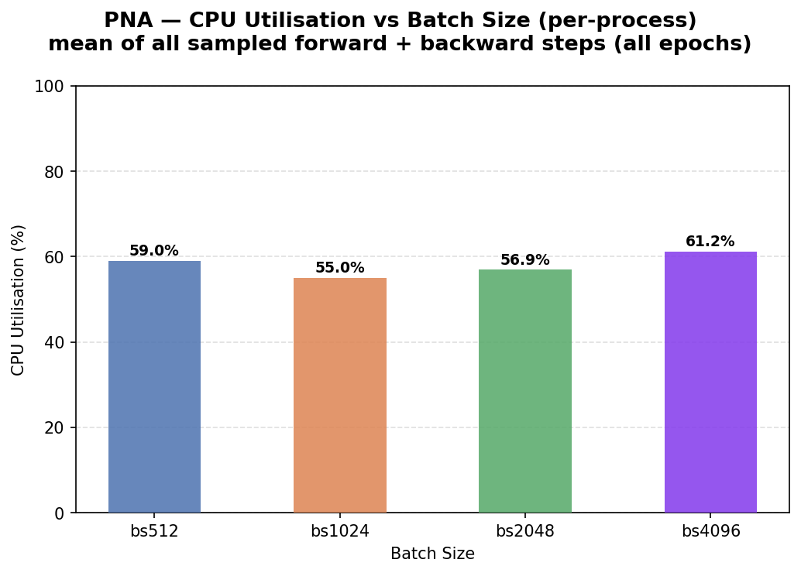 |
| *Average GPU utilisation (%) across all sampled steps and epochs* | *Average per-process CPU utilisation (%) across all sampled steps and epochs* |

**GPU utilisation**: As batch size increases, GPU utilisation rises. The mechanism is straightforward: a larger batch produces a larger batched molecular graph, with more nodes and edges processed in a single forward pass. This increases the arithmetic intensity of each kernel launch and improves GPU occupancy — the GPU's SMs are kept busier longer per kernel rather than spending more time on kernel launch overhead relative to computation. However, the improvement is sub-linear and plateaus at larger batch sizes. The fundamental constraint is the sparse topology of molecular graphs: regardless of how many molecules are batched, each individual neighbourhood aggregation still operates on a small, irregular set of neighbours. Larger batches aggregate more of these small operations into single kernel calls but cannot eliminate the underlying sparsity.

**CPU utilisation**: Per-process CPU utilisation shows a moderate increase with batch size. The DataLoader's collation step merges more `Data` objects per batch at higher batch sizes, generating more Python-side work per step. Additionally, larger batches produce more short-lived Python objects (larger edge index tensors, larger feature tensors, larger batch assignment vectors), which modestly increases the Python interpreter's memory management workload within the measured step window. Despite this, absolute CPU utilisation remains low across all batch sizes, confirming that the training loop is GPU-latency-bound at all configurations — the CPU is never the bottleneck.

### 7.3 Energy vs. Batch Size

| | |
|:---:|:---:|
| 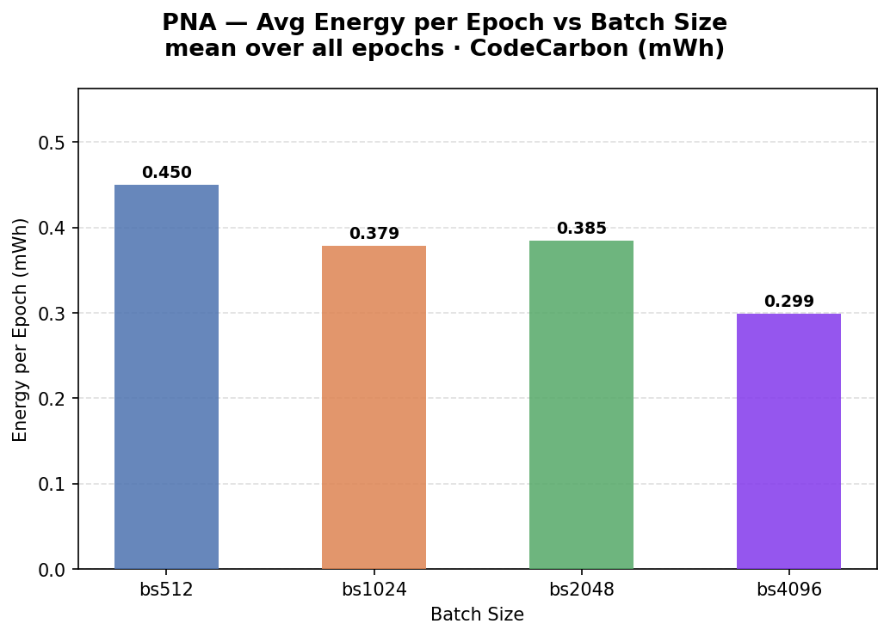 | 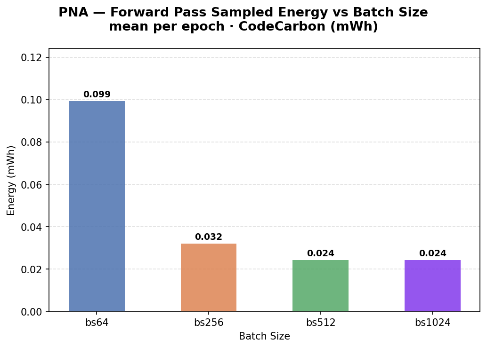 |
| *Mean total sampled energy per epoch (mWh)* | *Mean forward pass sampled energy per epoch (mWh)* |

| | |
|:---:|:---:|
| 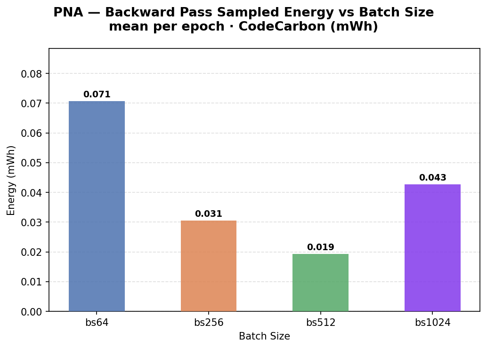 | 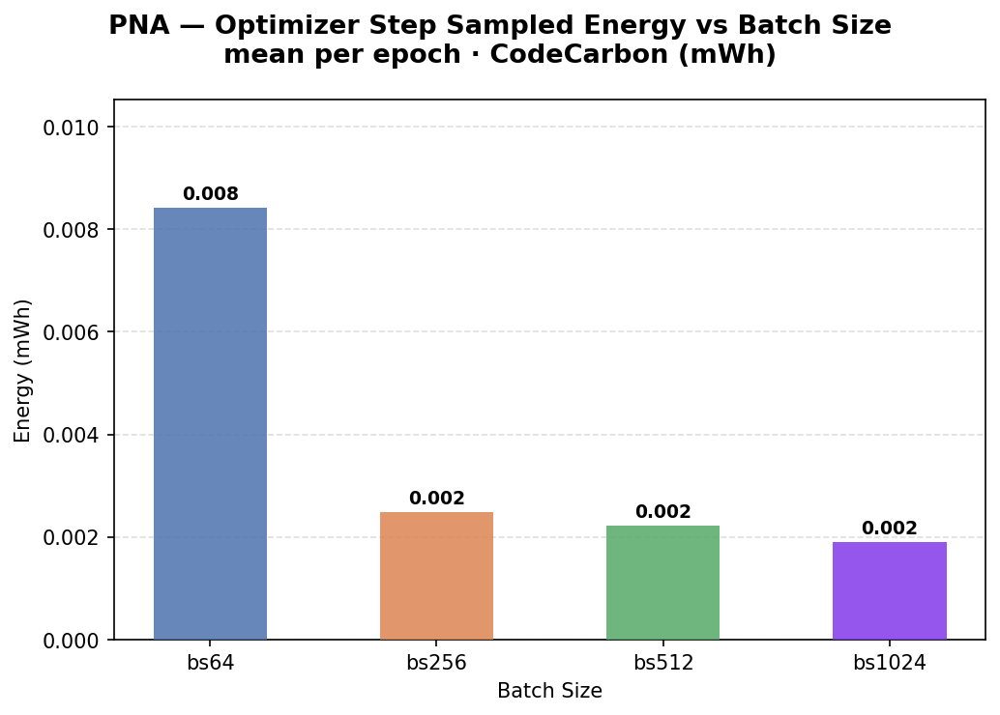 |
| *Mean backward pass sampled energy per epoch (mWh)* | *Mean optimizer step sampled energy per epoch (mWh)* |

**Total energy per epoch**: The total per-epoch energy changes non-monotonically with batch size, reflecting the interplay of two competing effects. On one hand, larger batches require more GPU computation per step, which should increase per-step energy. On the other hand, larger batches process more samples per step, so the same number of total samples is covered in fewer steps per epoch — and each step has a higher GPU utilisation, reducing the fraction of step time that the GPU sits idle while the constant-TDP CPU continues to draw power at full rate. The dominant factor in practice is the constant CPU TDP: since CPU energy is attributed at a fixed rate per second of wall-clock time, any batch size that reduces the total wall-clock time per epoch (by covering more samples per step with higher utilisation) will reduce total CPU energy and therefore total per-epoch energy.

**Forward energy per epoch**: The forward pass energy closely tracks the total energy trend, which is expected since forward accounts for roughly 35–45% of per-step energy at all batch sizes. Larger batches perform more floating-point operations per forward pass (more graph nodes and edges), increasing forward energy per step, but the step-count reduction per epoch means the per-epoch average can remain relatively stable or decrease at efficiency-gaining batch sizes.

**Backward energy per epoch**: The backward pass follows the same trend as forward, typically being the largest energy consumer per step (~50–60% of step energy). The backward pass is more sensitive to batch size than forward because gradient accumulation over larger irregular graphs involves more intermediate tensor allocations and more complex autograd graph traversal — both of which increase wall-clock time and therefore the CPU TDP charge. The relative proportions of forward and backward energy remain roughly stable across batch sizes, confirming that both phases scale similarly with batch complexity.

**Optimizer energy per epoch**: The optimizer step energy is the smallest component and shows the least sensitivity to batch size. Adam weight updates are proportional to the number of model parameters, not to batch size or graph size — the parameter count is fixed regardless of how many molecules are in the batch. Any variation in optimizer energy across batch sizes reflects differences in step duration (wall-clock time for optimizer step), which may slightly increase at larger batches due to larger gradient tensors being transferred, but this effect is small. The near-flat optimizer energy across batch sizes confirms that it is genuinely batch-size-independent.

### 7.4 Key Takeaways

1. **Larger batches improve GPU utilisation** but encounter diminishing returns due to the irreducible sparsity of molecular graph neighbourhoods. PNA cannot achieve CNN-like GPU saturation regardless of batch size.

2. **CPU energy dominates at all batch sizes** because CodeCarbon attributes energy at the constant CPU TDP rate. Reducing per-epoch wall-clock time (via higher GPU utilisation at larger batches) is the primary lever for reducing total carbon emissions.

3. **Per-epoch energy is roughly stable or decreases modestly at larger batch sizes** when the epoch count is scaled proportionally, because the efficiency gain from processing more samples per step (higher GPU occupancy, fewer total kernel launch overheads per sample) partially offsets the increased per-step compute cost. This confirms that larger batch sizes can be more energy-efficient for this workload when the training budget (total samples processed) is held constant.

4. **Optimizer energy is batch-size-independent**, confirming it reflects pure parameter-count cost rather than data-dependent computation. Its small, flat contribution at all batch sizes means it is not a target for batch-size-based energy optimisation.

5. **GC pressure scales with batch size**: larger batches create more short-lived Python objects per step, increasing generation-promotion rates. This is not visible in the energy plots (GC is excluded from measurements via manual inter-epoch collection) but it does affect the latency spike pattern visible in the simple timing baseline.

---

## Running the Experiments

All experiments are launched via scripts in `scripts/`. Each script accepts a `-bs <batch_size>` argument (default: 512) and automatically scales the epoch count. Each script targets a SLURM cluster via `srun.sh`; for local runs, replace `srun.sh` with `bash_srun.sh`.

```bash
# 1. Simple baseline (default bs=512)
bash scripts/start-pna-simple.sh

# 2. GC spike attribution (gc-on and gc-off rounds)
bash scripts/start-pna-spike.sh

# 3. Manual GC timing baseline (used for overhead comparison)
bash scripts/start-pna-manual-gc.sh

# 4. Hardware utilisation measurement
bash scripts/start-pna-utils.sh

# 5. Energy and carbon measurement
bash scripts/start-pna-carbon.sh

# Override batch size (epoch count scales automatically)
bash scripts/start-pna-utils.sh  -bs 1024
bash scripts/start-pna-carbon.sh -bs 64

# Generate all plots
python pna_result/plot_simple.py
python pna_result/plot_spike.py
python pna_result/plot_utils.py
python pna_result/plot_carbon.py
python pna_result/plot_overhead.py

# Batch size comparison (requires bs=64, 256, 512, 1024 runs for util and carbon)
python pna_result/plot_batchsize.py
```

**Note on `start-pna-spike.sh`**: This script temporarily renames `pna_carbon.py` and `pna_manual_gc.py` out of the stats auto-discovery path before running, then restores them afterwards. This prevents CodeCarbon's import-time initialisation from perturbing GC state and suppressing the spikes the experiment is designed to observe.

## Repository Structure

```
src/
  models/pna/          — PNA model definition and trainer dispatch
  trainer/
    pna_simple.py      — Base PNA trainer (warmup + measured epochs, GC on)
    pna.py             — Measurement trainer (manual GC between epochs)
    pna_spike.py       — Spike trainer (gc-on then gc-off rounds)
    stats/
      pna_simple.py    — Simple timing stats → simple/
      pna_manual_gc.py — Manual GC timing stats → manual/
      pna_spike.py     — Spike timing + GC event recording → spike/
      pna_utils.py     — Hardware utilisation stats → utils/
      pna_carbon.py    — CodeCarbon energy/carbon stats → carbon/
pna_result/
  simple/              — Simple timing CSVs and plots
  spike/               — GC spike CSVs and plots
  manual/              — Manual GC timing CSVs
  utils/               — Hardware utilisation CSVs and plots
  carbon/              — Energy and carbon CSVs and plots
  plots/               — Cross-workload comparison plots (overhead, batch size)
  plot_simple.py       — Plotting script for simple results
  plot_spike.py        — Plotting script for spike results
  plot_utils.py        — Plotting script for utilisation results
  plot_carbon.py       — Plotting script for energy/carbon results
  plot_overhead.py     — Overhead comparison bar chart
  plot_batchsize.py    — Batch size effect comparison (GPU/CPU util + energy)
scripts/
  start-pna-simple.sh       — [-bs N]  simple baseline
  start-pna-spike.sh        — [-bs N]  GC spike attribution
  start-pna-manual-gc.sh    — [-bs N]  manual GC timing baseline
  start-pna-utils.sh        — [-bs N]  hardware utilisation
  start-pna-carbon.sh       — [-bs N]  energy and carbon
```
