# PNA GNN: Performance, Energy, and Efficiency Analysis

This report presents a profiling study of the **Principal Neighbourhood Aggregation (PNA)** graph neural network trained on a molecular property prediction task. We examine how batch size affects training latency, GPU utilisation, and energy consumption, and investigate the sources of step-time variability at different operating points.

All experiments run on a single SLURM-managed GPU node. Four batch sizes are studied: **512**, **1024**, **2048**, and **4096** (the largest that fits in GPU memory). Batch size **4096** is the primary focus; **512** is the secondary reference for contrast.

---

## Table of Contents

1. [The PNA Workload](#1-the-pna-workload)
2. [Training at Batch Size 4096](#2-training-at-batch-size-4096)
3. [Training at Batch Size 512 — GC Spike Attribution](#3-training-at-batch-size-512--gc-spike-attribution)
4. [Batch-Size Comparison](#4-batch-size-comparison)
5. [Energy and Carbon](#5-energy-and-carbon)
6. [Measurement Overhead](#6-measurement-overhead)
7. [Summary](#7-summary)

---

## 1. The PNA Workload

### What Is PNA?

**Principal Neighbourhood Aggregation (PNA)** is a GNN architecture that applies *multiple* aggregation functions (mean, min, max, std) simultaneously at each layer and scales their outputs by node degree. This multi-aggregator design makes it more expressive than standard message-passing networks.

The model is trained on a molecular dataset where each graph represents a molecule (nodes = atoms, edges = bonds). The regression target is a quantum-chemical property. The model uses **64 PNA convolution layers**, **4 aggregators**, and **3 scalers**, totalling ~4 million parameters.

### Training Pipeline

Each training step follows three phases:

```
 FORWARD       64 layers of neighbourhood aggregation + global pooling + L1 loss
 BACKWARD      autograd through 64 conv layers over irregular sparse graphs
 OPTIMIZER     Adam weight update + cosine-annealing LR schedule
```

Data loading is handled by PyTorch Geometric's `DataLoader`, which collates variable-size molecular graphs into a single batched graph on the CPU. This Python-heavy batching process is a key source of both CPU load and garbage-collection pressure.

---

## 2. Training at Batch Size 4096

At batch size 4096, the training dataset yields **3 steps per epoch**: two full batches of 4096 graphs and one partial batch of 1808 graphs (the remainder). This creates a distinctive repeating pattern.

### The Step-Time Pattern Is Driven by Batch Shape

The total-time plot shows a striking alternation between ~775 ms steps and ~285 ms steps. At first glance this looks like a performance anomaly:

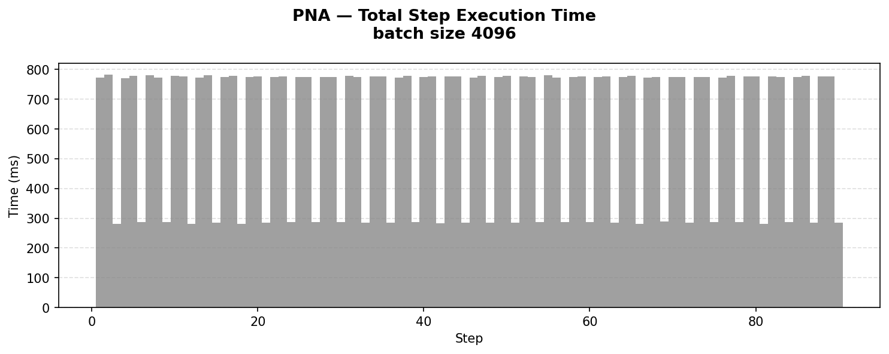

But overlaying the batch-shape metadata immediately reveals the cause — the short steps are simply the **partial final batch** of each epoch:

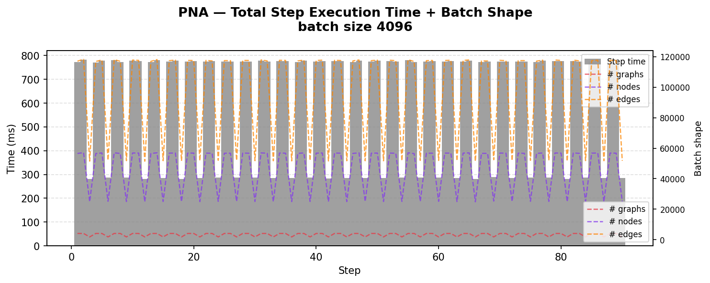

Every third step has roughly half the nodes (~25 000 vs ~57 000) and half the edges (~52 000 vs ~118 000). Since GNN computation scales with the number of nodes and edges, step time scales proportionally. There is no "spike" — the training loop is behaving exactly as expected given the dataset size.

### Time Breakdown

| | |
|:---:|:---:|
| 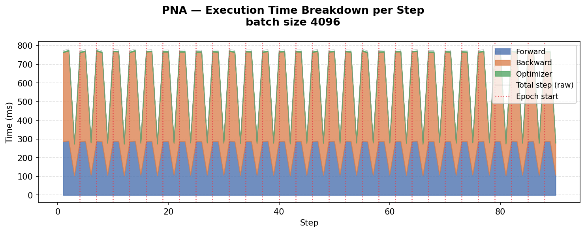 |  |
| *Execution time breakdown per step* | *Training loss per step* |

<table>
<tr>
<td width="340"></td>
<td valign="top">

The backward pass dominates at **61.3%** of mean step time (375.6 ms), while the forward pass takes **37.1%** (227.6 ms). The optimizer step is negligible at **0.7%** (4.1 ms).

This split is characteristic of deep GNNs: backpropagating gradients through 64 convolution layers over irregular sparse graphs is significantly more expensive than the forward pass, since each layer must traverse the autograd graph and accumulate gradients across variable-size neighbourhoods.

The loss curve is stable throughout, confirming that the step-time variation is purely structural (batch composition) and has no effect on convergence.

</td>
</tr>
</table>

### Hardware Utilisation at Batch Size 4096

| | |
|:---:|:---:|
| 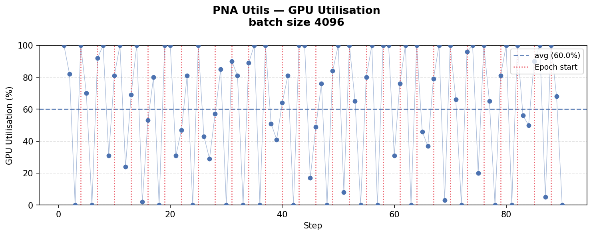 | 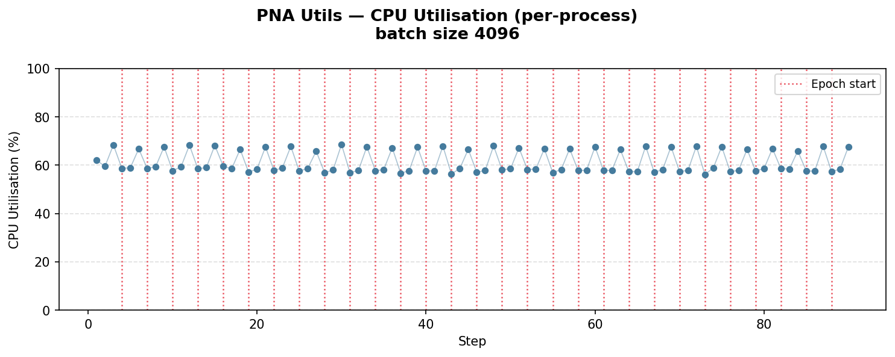 |
| *GPU utilisation — avg 60.0%* | *Per-process CPU utilisation — avg 61.1%* |

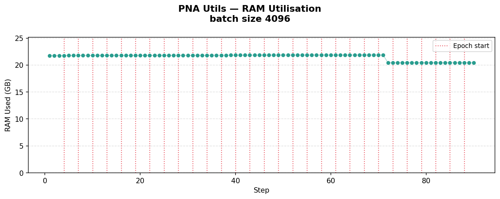

GPU utilisation averages **60%** at this batch size — the highest across all configurations tested. With ~57 000 nodes and ~118 000 edges per full batch, the CUDA kernels (scatter, gather, matrix multiplications) are large enough to keep the GPU's streaming multiprocessors continuously occupied. This is the only batch size where the workload crosses the threshold from **launch-overhead-bound** to **compute-bound**.

---

## 3. Training at Batch Size 512 — GC Spike Attribution

At batch size 512, each epoch has 20 steps and execution time is far more uniform — except for **periodic spikes** that nearly triple the step latency, from ~110 ms to 240–290 ms.

| | |
|:---:|:---:|
| 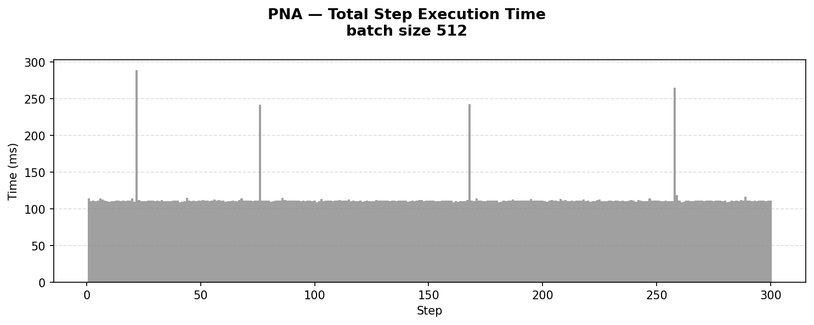 | 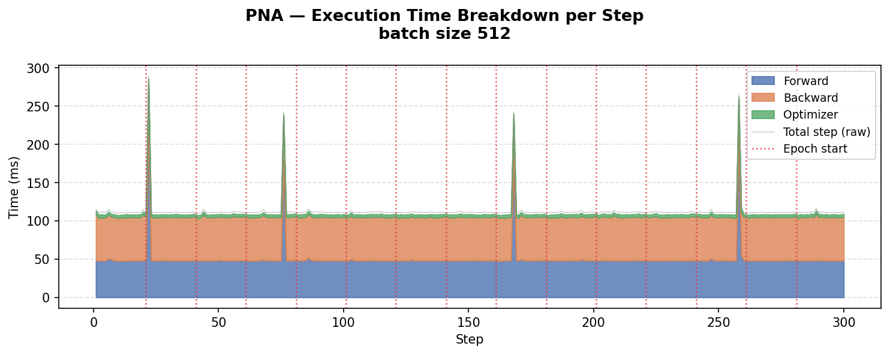 |
| *Step execution time — note the periodic spikes* | *Time breakdown — spikes appear in all substeps simultaneously* |

Unlike the batch-shape-driven variation at bs4096, these spikes are caused by **Python's garbage collector**.

### Identifying GC as the Cause

We ran the same workload with GC event logging enabled. Annotating generation-2 collection events onto the time-breakdown reveals a perfect correlation — **every spike aligns with a gen-2 GC sweep**:

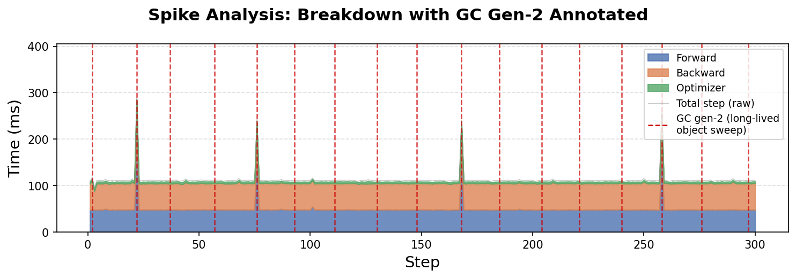

Each gen-2 collection pauses the process for **130–180 ms**. These pauses are triggered by PyTorch Geometric's `DataLoader`, which creates many short-lived Python objects (graph tensors, batch index tensors) every step. These objects get promoted through Python's generational GC until they trigger a gen-2 sweep at a roughly periodic interval.

### Disabling GC Eliminates the Spikes

Running with automatic GC disabled produces a **perfectly flat** execution trace:

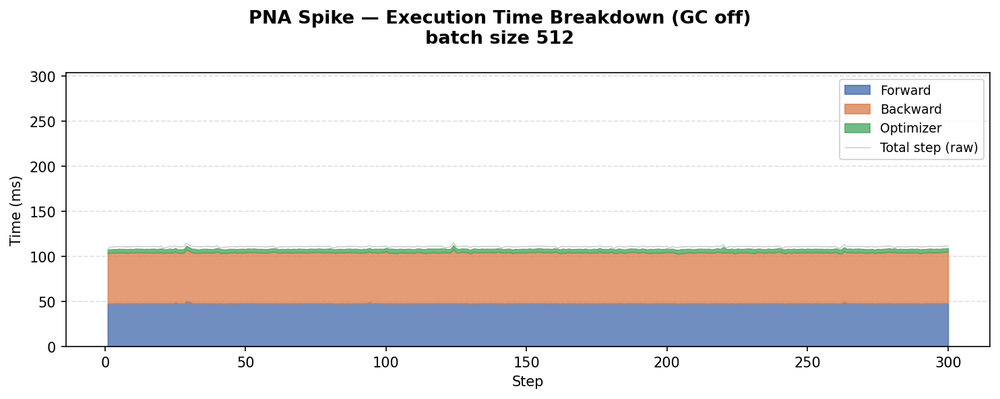

Step time holds steady at ~108 ms with no variation, confirming that GC is the **sole source** of the spikes at this batch size.

<table>
<tr>
<td width="340">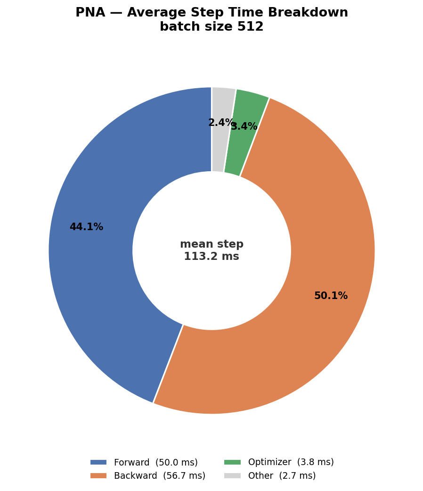</td>
<td valign="top">

At bs512, the forward and backward passes are more balanced than at bs4096: forward takes ~44% and backward ~50% of step time. The optimizer remains small at ~3%.

The more balanced split is because smaller batches produce smaller batched graphs, which reduces the cost ratio between backward (gradient accumulation over fewer nodes) and forward (aggregation over fewer neighbourhoods). As batch size grows, the backward pass scales super-linearly relative to forward due to autograd memory management over larger intermediate tensors.

</td>
</tr>
</table>

### The Same GC Pattern Appears at Batch Size 4096

GC events also affect bs4096 training, but the pattern is different: collections fire every 2–3 steps (vs every ~20 steps at bs512) because larger batches create more Python objects per step, accelerating generational promotion. The spike experiment at bs4096 confirms this and shows that disabling GC produces an equally flat trace:

| | |
|:---:|:---:|
| 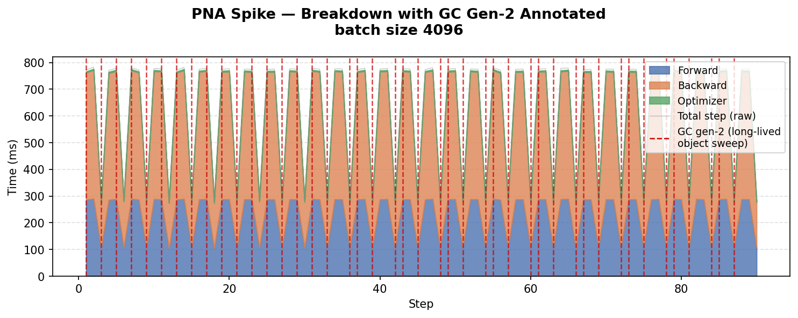 | 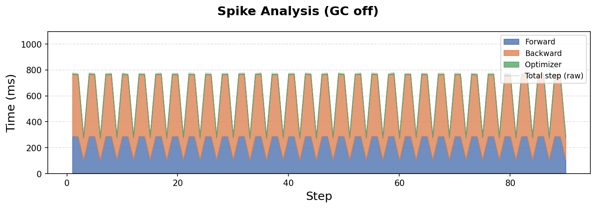 |
| *GC on + annotated: gen-2 events every 2–3 steps* | *GC off: flat ~775 ms trace* |

---

## 4. Batch-Size Comparison

### Epoch Latency

Despite much longer per-step times, larger batch sizes complete each epoch **faster** because they process the same dataset in fewer steps:


| Batch Size | Mean Step Time | Steps/Epoch | Epoch Latency |
|:----------:|:--------------:|:-----------:|:-------------:|
| 512        | 113 ms         | 20          | **2.3 s**     |
| 1024       | 148 ms         | 10          | **1.5 s**     |
| 2048       | 322 ms         | 5           | **1.6 s**     |
| 4096       | 613 ms         | 3           | **1.8 s**     |

Batch size 1024 achieves the lowest epoch latency. Beyond that, per-step compute grows faster than the step-count reduction, so epoch latency rises slightly — but all larger sizes remain well below bs512.

### GPU Utilisation — The Dip-Then-Jump Pattern

GPU utilisation shows a striking non-monotonic shape: it **drops** from bs512 to bs1024, then **climbs steeply** to 60% at bs4096.

| | |
|:---:|:---:|
|  |  |
| *GPU utilisation: dip at 1024, then a steep rise* | *CPU utilisation: relatively flat (55–61%)* |

| Batch Size | GPU Util | CPU Util |
|:----------:|:--------:|:--------:|
| 512        | 26.6%    | 59.0%    |
| 1024       | 13.5%    | 55.0%    |
| 2048       | 16.2%    | 56.9%    |
| 4096       | 60.0%    | 61.2%    |

**Why does utilisation *drop* from bs512 to bs1024?** The utilisation sampler fires at 500 ms intervals. At bs512, steps are short (~110 ms) and there are many per epoch; the sampler often captures the GPU mid-computation. At bs1024, step time grows to ~150 ms but is still short — the GPU frequently sits idle between kernel launches during data loading and Python overhead. The sampler is more likely to land in these idle gaps, pulling the average down.

**Why does it *jump* at bs4096?** At this batch size the individual CUDA kernels operate over ~57 000 nodes and ~118 000 edges. These kernels are large enough to keep the GPU's streaming multiprocessors continuously occupied. The workload crosses from **launch-overhead-bound** to **compute-bound** — the GPU is genuinely busy for the duration of each step, and the sampler consistently captures high utilisation.

CPU utilisation remains relatively flat across all batch sizes (55–61%), confirming that the single allocated core is consistently loaded by the combination of DataLoader collation and CUDA kernel dispatch overhead.

### Batch Sizes 1024 and 2048

| | |
|:---:|:---:|
| 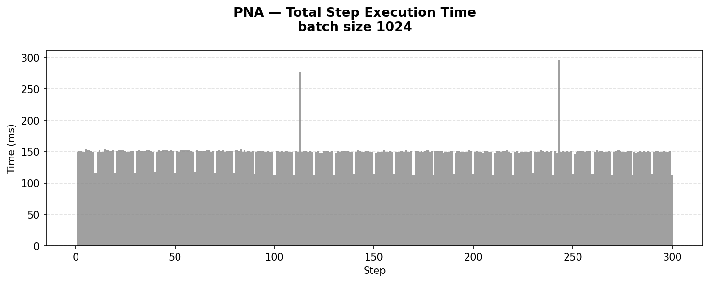 | 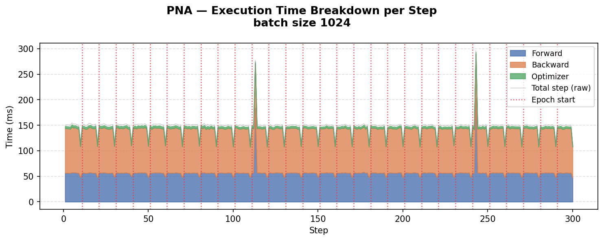 |
| *bs1024: ~148 ms steps with occasional GC spikes* | *bs1024: forward/backward split still balanced* |

| | |
|:---:|:---:|
| 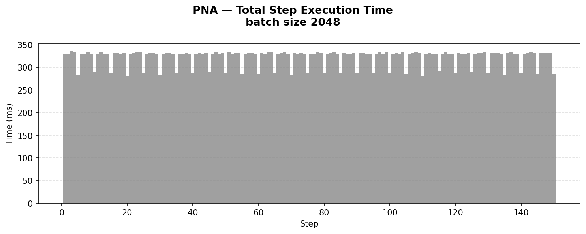 | 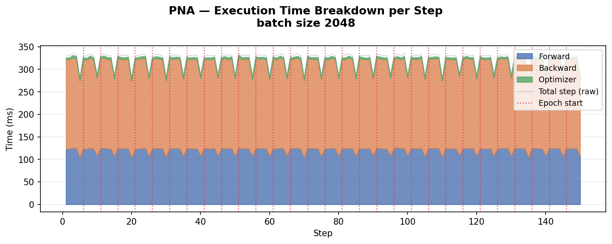 |
| *bs2048: ~322 ms steps, partial-batch dips beginning to appear* | *bs2048: backward pass starts dominating more clearly* |

These intermediate batch sizes show a transition: GC spikes are still present (as at bs512), but partial-batch effects start to become visible (as at bs4096). At bs2048, each epoch has 5 steps — 4 full batches and 1 partial — and the partial batch is visually distinct in the time trace.

---

## 5. Energy and Carbon

### Energy per Epoch

Larger batch sizes are more **energy-efficient** per epoch, consuming up to 33% less energy:


| Batch Size | Energy/Epoch |
|:----------:|:------------:|
| 512        | 0.450 mWh    |
| 1024       | 0.379 mWh    |
| 2048       | 0.385 mWh    |
| 4096       | 0.300 mWh    |

This follows directly from higher GPU utilisation: bs4096 keeps the hardware busy doing useful computation rather than idling at near-constant base power draw. Even though each step consumes more energy in absolute terms, fewer steps per epoch and better hardware utilisation more than compensate.

### Energy Breakdown by Hardware

| | |
|:---:|:---:|
| 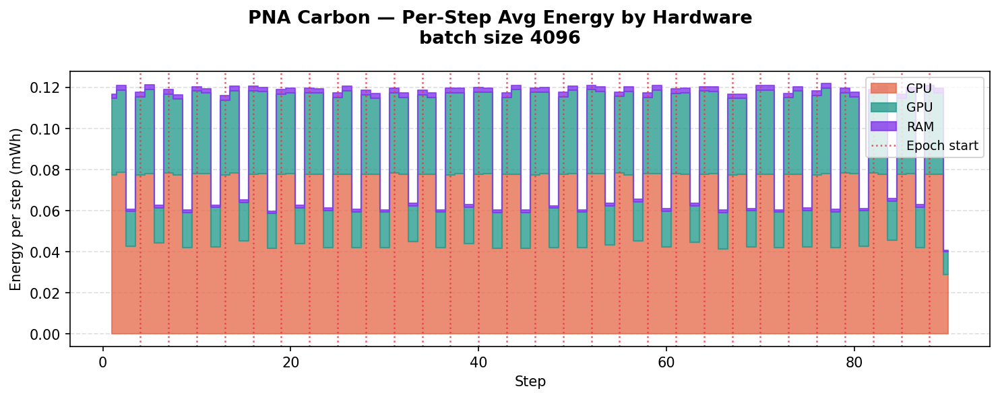 | 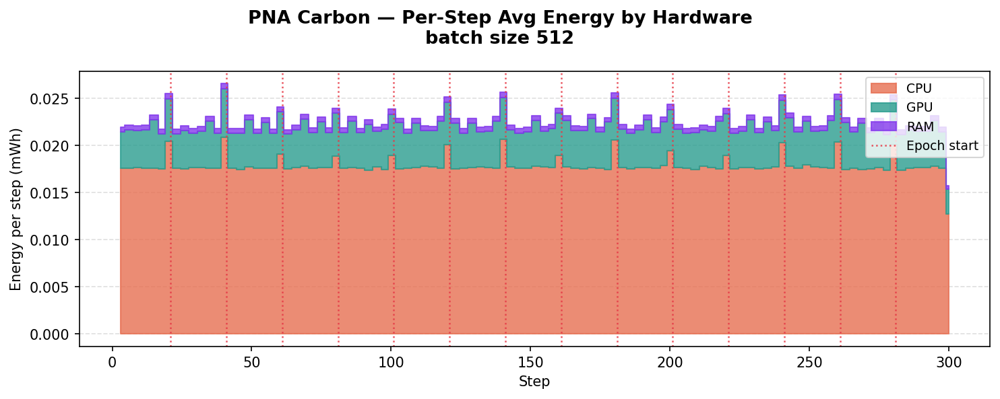 |
| *bs4096: per-step energy by hardware* | *bs512: per-step energy by hardware* |

<table>
<tr>
<td width="340"></td>
<td valign="top">

At bs4096, the **CPU dominates energy consumption** at **66.1%**, with the GPU accounting for **32.0%** and RAM a negligible **1.8%**.

This is characteristic of GNN workloads where significant CPU time is spent on irregular data preparation (graph batching, Python object handling) while GPU kernels, though intensive, are relatively short-lived. CodeCarbon attributes CPU energy at a constant TDP rate, so the CPU's share remains high even when the GPU is doing the heavy computational lifting.

The practical implication is that **reducing wall-clock training time** — by improving GPU occupancy or overlapping data loading — is the primary lever for reducing both energy consumption and carbon emissions.

</td>
</tr>
</table>

### Energy per Hardware Component Across Batch Sizes


Per-step energy for all hardware components grows with batch size (larger batches = more computation per step), but CPU consistently dominates. The increasing GPU share at larger batch sizes reflects the higher GPU utilisation — the GPU draws more power when it is actually busy, narrowing the gap with the constant-TDP CPU attribution.

### Per-Step Energy Traces

| | |
|:---:|:---:|
| 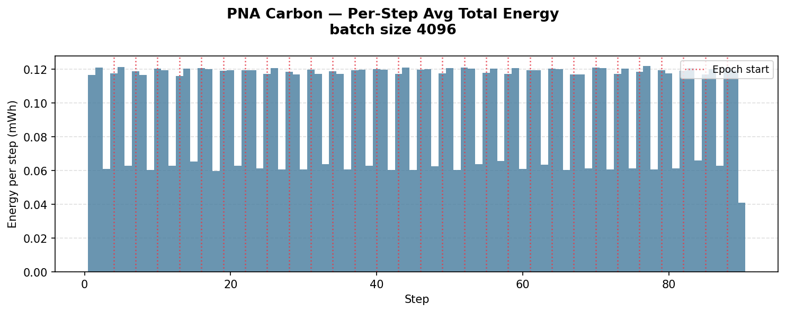 | 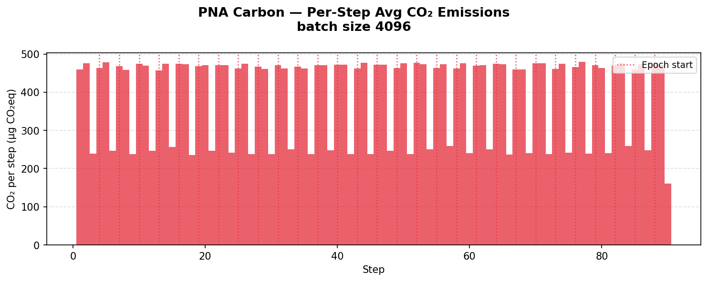 |
| *bs4096: per-step energy (mWh)* | *bs4096: per-step CO₂ emissions (µg CO₂eq)* |

| | |
|:---:|:---:|
| 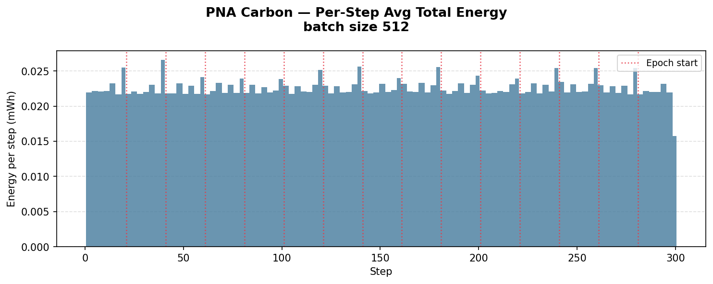 | 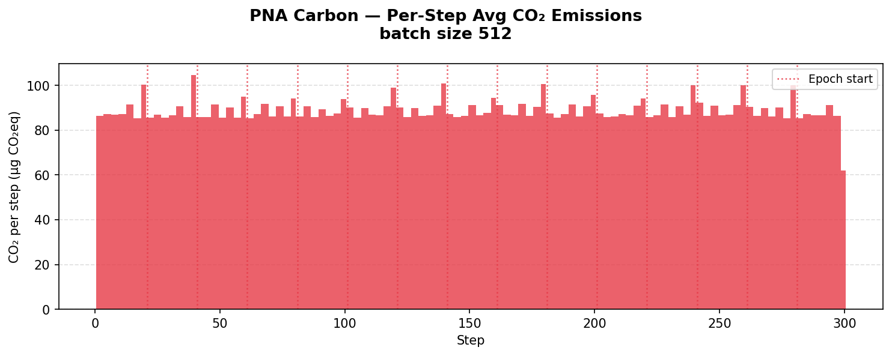 |
| *bs512: per-step energy (mWh)* | *bs512: per-step CO₂ emissions (µg CO₂eq)* |

<table>
<tr>
<td width="340">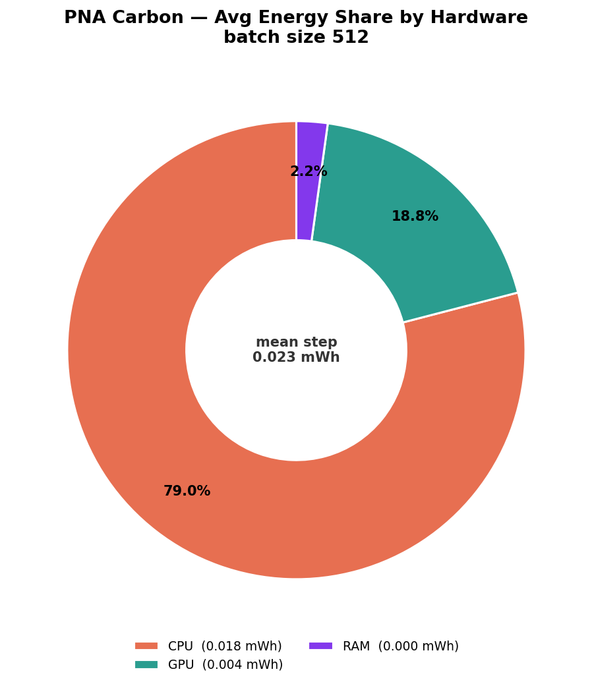</td>
<td valign="top">

At bs512, CPU energy dominance is even more pronounced. The GPU operates at just 26.6% utilisation, drawing proportionally less power, while the CPU's constant TDP attribution runs at full rate for every second of wall-clock time.

The carbon emissions traces mirror the energy traces exactly (Quebec's grid carbon intensity is a constant factor), so the same conclusions apply: **higher GPU utilisation at larger batch sizes reduces total emissions per epoch**.

</td>
</tr>
</table>

---

## 6. Measurement Overhead

Instrumenting training with utilisation sampling and energy tracking adds minimal overhead. At bs4096, mean step latency across four configurations is:


| Configuration          | Mean Step Latency | Overhead vs Baseline |
|:----------------------:|:-----------------:|:--------------------:|
| Simple (timers only)   | 612.9 ms          | —                    |
| Baseline (gc-manual)   | 610.8 ms          | reference            |
| Util measurement       | 611.8 ms          | **+0.2%**            |
| Carbon (CodeCarbon)    | 615.5 ms          | **+0.8%**            |

The heaviest instrumentation (CodeCarbon energy tracking with background power sampling) adds less than **1% overhead**, confirming that the measurement tooling does not meaningfully distort any of the results presented in this report.

---

## 7. Summary

1. **Batch size 4096** achieves the highest GPU utilisation (60%) and lowest energy per epoch (0.300 mWh), making it the most hardware-efficient configuration despite not having the fastest epoch latency.

2. **Step-time spikes have different root causes at different batch sizes:**
   - At **bs4096**, the periodic short steps are simply **partial batches** at epoch boundaries (1808 vs 4096 graphs). This is expected, not a performance problem.
   - At **bs512**, spikes are caused by **Python gen-2 garbage collection** pauses of 130–180 ms. Disabling GC eliminates them entirely.

3. **GPU utilisation follows a non-monotonic curve** (26.6% → 13.5% → 16.2% → 60.0%). Small and medium batch sizes underutilise the GPU because CUDA kernels are too small to saturate the hardware. Only at bs4096 does the per-step workload cross the threshold for sustained GPU occupancy.

4. **Larger batches are more energy-efficient per epoch** because they amortise fixed idle power draw over more useful computation — a direct consequence of higher GPU utilisation.

5. **CPU energy dominates** at all batch sizes (66% at bs4096) due to CodeCarbon's constant-TDP attribution model. The primary lever for reducing carbon footprint is reducing wall-clock training time.

6. **Measurement overhead is negligible** (<1%), so all results can be taken at face value.
